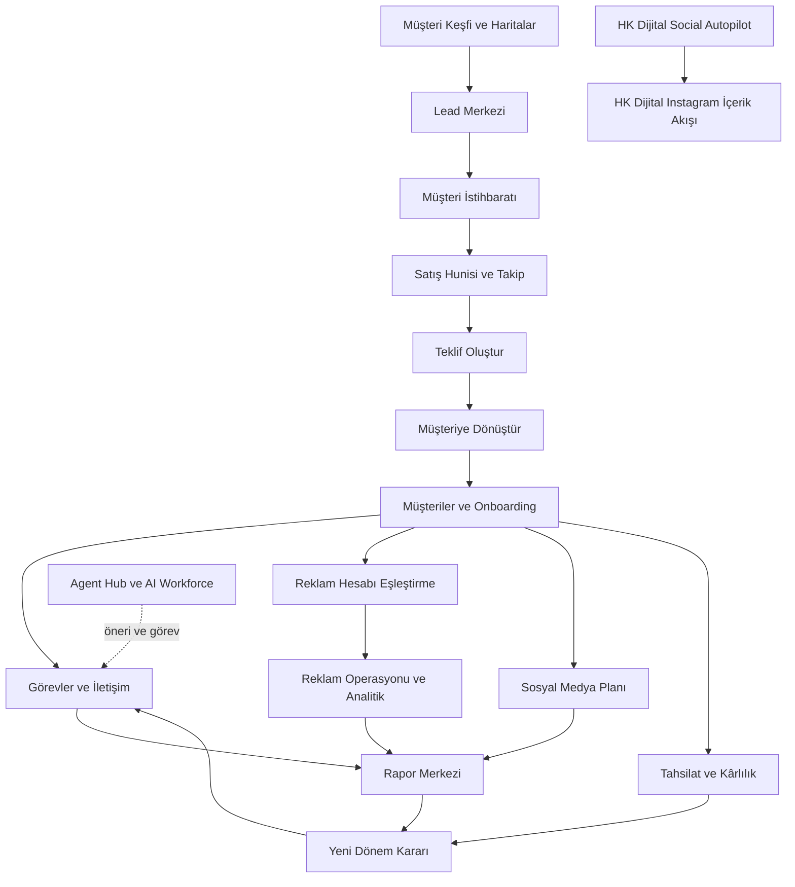

# HK ADMIN EL KİTABI
## Dijital Ajans Yönetim Sistemi Kullanım, Operasyon ve AI Rehberi

**Kullanım • Operasyon • AI • Satış • Reklam • Müşteri Yönetimi**

HK Dijital · Birinci baskı · 13 Eylül 2026

> Ajansın hafızasını kayıtta, kararını kanıtta, sonraki adımını görevde tut.

## Bu kitabın kapsamı ve doğrulama sınırı

Bu el kitabı `/Users/hayrikamali/Projects/hk-dijital-production-final` deposunun `1e9566172c1293e766ba6705f3f10a529b10e3fd` sürümündeki uygulama kodundan hazırlanmıştır. Navigasyon tanımları; bunları açan sayfalar; gerçek ekran bileşenleri; işlem uçları ve ilgili veri/AI servisleri birlikte incelenmiştir. Eski tasarım envanterleri güncel davranış yerine kullanılmamıştır.

**“Mevcut” bu sürümde uygulanmış davranış demektir.** Bu kitap hazırlanırken production (canlı ortam) deployment kimliği, oturum içindeki ekranlar, dış servis abonelikleri ve ortam değişkenlerinin değerleri bağımsız olarak doğrulanmamıştır. Dolayısıyla kitap, canlıdaki her servisin şu anda bağlı veya her işlemin başarılı olduğu iddiasını taşımaz. Kodda bulunan ama bağlantı, izin, içerik veya sağlayıcı gerektiren işlemler koşullu anlatılır. Canlıda farklı ekran görülürse sürüm ve yetki kontrolü yapılır.

Uygulama kodu, veritabanı, migration (veritabanı şema değişikliği) ve canlı ortam değiştirilmemiştir. Gerçek müşterilerin bilgileri ve erişim anahtarları kitaba alınmamıştır. Örnek işletmeler kurgusaldır. Kitabın sonundaki kaynak dizini, bakım ekibinin anlatımı kodla yeniden karşılaştırabilmesi içindir.

[PREMIUM SAYFA TASARIMI]
Kapakta sıcak kırık beyaz dokulu kâğıt, siyah mürekkep ve ince HK Gold çizgiler. Başlık geniş ve sakin; alt kenarda küçük bir tarayıcı penceresi, ajans notları ve bağlantılı üç kart: “Müşteri”, “Operasyon”, “Sonuç”. Bu metin baskısı görsel üretim için ana kaynaktır; illüstrasyonlar gerçek ekran görüntüsü yerine kullanılmaz.

## Ekran görüntüsü durumu

Bu baskıda 9 planlanan Şekil'den **7'si gerçek HK Admin ekran görüntüsüdür** (Şekil 01, 02, 03, 06, 07, 08, 09) — mevcut Playwright/QA girişi (`tests/e2e/fixtures/qa-auth.ts`, Secret Access Control Center dahil) kullanılarak yerel ortamda gerçek admin oturumu açılıp çekilmiştir. Şekil 07 (Onboarding) ve Şekil 08 (Muhasebe) gerçek işletme telefon numarası/tutar içerdiğinden, yayına alınmadan önce ilgili alanlar maskelenmiştir — geri kalan arayüz gerçektir. Şekil 04 (AI Analiz Ayrıntıları) ve Şekil 05 (Ajan Kurulu) ayrı bir route'a sahip olmadığından (bir lead ayrıntısı içi panel) ve güvenilir, tekrarlanabilir bir test kaydı gerektirdiğinden bu baskıda ertelenmiştir; metin bu iki ekran için **Menü / Sayfa / Ekranda görülecekler** bilgisini eksiksiz verir. `docs/hk-admin-el-kitabi/ekran-goruntuleri-dizini.md` dosyası her Şekil numarasının durumunu izler.

# BU KİTAP NASIL KULLANILIR?

Bu el kitabı baştan sona okunabilir veya ihtiyaç anında ilgili bölüme atlanarak kullanılabilir. Her bölüm aynı düzeni izler: modülün ne işe yaradığı → ne zaman kullanılacağı → menüde nerede olduğu → ekranda ne görüleceği → adım adım kullanım → sonraki adım → profesyonel kullanım → dikkat edilecekler.

**Kutu ve etiket sistemi** kitap boyunca birebir aynı anlamla kullanılır:

| Kutu | Anlamı |
|---|---|
| `[BU EKRANDASIN]` | O an açık olması beklenen menü, sayfa yolu ve ekranın amacını gösterir. |
| `[EKRAN GÖRÜNTÜSÜ]` / `[EKRAN GÖRÜNTÜSÜ — ŞEKİL NN]` | Gerçek arayüz ekran görüntüsünün gireceği yer; Şekil numarası `ekran-goruntuleri-dizini.md` ile eşleşir. |
| `[HK İPUCU]` | Genel, modül bağımsız kullanım önerisi. |
| `[PROFESYONEL KULLANIM]` | Deneyimli kullanıcı için ileri seviye çalışma önerisi. |
| `[SATIŞ İPUCU]` | Satış/keşif bağlamına özel öneri. |
| `[OPERASYON İPUCU]` | Günlük operasyon/teslim bağlamına özel öneri. |
| `[AI NOTU]` | Yapay zekâ davranışı, sınırı veya yanlış yorumlanma riski hakkında uyarı. |
| `[DİKKAT]` | Gerçek bir sınırlama, veri riski veya yanlış kullanım riski. |
| `[KISA YOL]` | Klavye kısayolu veya hızlı erişim yolu — yalnızca kodda gerçekten var olanlar. |
| `[SIRADAKİ ADIM]` | Bu ekrandaki işin tamamlanmasından sonra hangi modüle geçileceği. |
| `[SIK YAPILAN HATA]` | Gerçekçi, sık tekrarlanan bir kullanım hatası ve düzeltmesi. |
| `[GERÇEK VERİ]` | O bölümdeki bilginin kaydedilmiş/kaynaklı gerçek veriden geldiğini işaretler. |
| `[AI YORUMU]` | O bölümdeki bilginin yapay zekâ yorumu/önerisi olduğunu, doğrulanmış gerçek olmadığını işaretler. |
| `[GÖRSEL ÖNERİSİ]` / `[PREMIUM SAYFA TASARIMI]` | İllüstrasyon üretimi için görsel kavram notu; ekran görüntüsü değildir. |

[HK İPUCU]
Yeni başlayan bir çalışan önce Bölüm 0-2'yi (genel bakış, 15 dakikalık tur, sistem haritası), sonra kendi rolüne ait Bölüm 46'daki hızlı rehberi okumalıdır. Tüm kitabı ezberlemek gerekmez; hangi işin hangi bölümde anlatıldığını bilmek yeterlidir.

# İÇİNDEKİLER

**Başlarken**
1. HK Admin'e Genel Bakış
2. 15 Dakikada HK Admin
3. Giriş, Ekran Düzeni ve Kaydetme
4. HK Admin Sistem Haritası
5. Veriyi Doğru Okumak ve AI Şeffaflığı

**Ana Merkez**
6. Dashboard ve Ana Kontrol Merkezi

**Satış ve Keşif**
7. Müşteri Keşfi ve Haritalar
8. HK Opportunity Score
9. Lead Merkezi ve Satış Hunisi
10. Müşteri İstihbarat Motoru: Dört Seviye
11. Ajan Kurulu
12. HK Admin ile Müşteri Kazanma
13. Takip, Teklif ve Satış Koçu
14. Müşteriye Dönüştürme
25. Rakip İstihbarat Merkezi

**Müşteri Yönetimi**
15. Müşteriler ve Müşteri Profili
16. Yeni Müşteri Geldiğinde: Onboarding

**Operasyon**
17. Görevler, Takvim ve İletişim
18. Belgeler, Sözleşmeler, Medya ve Sektör Sistemleri

**Finans**
19. Muhasebe, Tahsilat ve Kârlılık

**Reklam ve Performans** *(rapor merkezi dahil)*
20. Rapor Merkezi ve Aylık Raporlar
21. Kampanyalar ve Reklam Hesabı Eşleştirme
22. Reklam Operasyon Merkezi ve Reklam Doktoru
23. Meta, Google Ads ve Web Analitiği
24. Büyüme Motoru, Funnel Planlayıcı ve Modül Pazarı

**İçerik ve AI**
26. Sosyal Medya Planı ve İçerik Hazırlığı
27. Social Autopilot
28. Blog, SEO ve Growth Intelligence
29. AI Görünürlüğü ve HK Ajans Zekası
30. Yapay Zekâ Stüdyosu, Prompt Merkezi ve AI Stratejisi
31. Agent Hub
32. HK AI Workforce
33. Otonom Operasyonlar

**Entegrasyonlar**
34. Entegrasyonlar ve API Durumu

**Sistem**
35. Kullanıcılar, Roller ve Güvenlik
36. Kalite, Sistem Sağlığı, Loglar ve Veri Aktarma
37. Web Sitesi Yönetimi ve Ayarlar
38. Masaüstü Uygulaması ve Kısayollar

**Uygulama ve Referans**
39. HK Dijital'de Bir Gün
40. Sorun Giderme
41. Operasyon Kontrol Listeleri
42. HK Admin Sözlüğü
43. Doğrulanmış Modül ve Kaynak Dizini
44. HK Admin Sayfa Dizini
45. Buton ve Aksiyon Dizini
46. Rol Bazlı Hızlı Rehberler

# 1. HK Admin'e Genel Bakış

HK Admin; potansiyel müşteriyi bulma, satış takibi, müşteri kurulumu, iş teslimi, raporlama ve tahsilatı aynı müşteri bağlamında bir araya getirir. Sistem yalnızca reklam metrikleri göstermez: kiminle görüşüleceği, hangi kurulumun eksik olduğu, hangi işin geciktiği ve bir sonraki sorumlunun kim olacağı da kayıt altına alınır.

Görünen dokuz ana merkez **Ana Merkez, Müşteri Yönetimi, Satış ve Keşif, Operasyon, Reklam ve Performans, İçerik ve AI, Finans, Entegrasyonlar, Sistem** olarak düzenlenir. Kaynak kodundaki “İçerik & Medya” gibi alt grup adları her zaman üst menüde aynı isimle görünmez. Güncel üst grup “İçerik ve AI”dır.

CRM (müşteri ilişkileri yönetimi), lead (potansiyel müşteri) kayıtlarını taşır. Müşteriye dönüşen kayıt firma ile ilişkilendirilir; görev, kampanya, belge, rapor ve ödeme bu firma bağlamından takip edilir. AI (yapay zekâ) bu kayıtları yorumlayabilir; eksik kayıtların yerine doğrulanmış bilgi üretmiş sayılmaz.

**Kim kullanır?** Ajans sahibi öncelik ve finansı, satış ekibi keşif ve takipleri, operasyon ekibi görev ve içerikleri, reklam uzmanı kanal sağlığını izler. Müşteri kullanıcısı aynı yönetim yetkilerine sahip değildir; kendisine açılmış müşteri panelini kullanır.

[HK İPUCU]
Her iş için üç soruyu cevapla: “Hangi müşteri?”, “Hangi kanıta dayanıyor?”, “Sonraki sorumlu ve tarih nedir?” Bunlardan biri yoksa kayıt operasyon açısından eksiktir.

[GÖRSEL ÖNERİSİ]
Dokuz merkezin çevrelediği bir müşteri kartı. Merkezde “Ortak müşteri bağlamı”, dış halkada menü isimleri.

# 2. 15 Dakikada HK Admin

Bu tur eğitim içindir; gerçek müşteri kaydını değiştirmek, mesaj göndermek veya yayın başlatmak gerektirmez.

1. **İlk üç dakika:** Dashboard'u aç. Kritik görevler, açık fırsatlar, ödeme ve sağlık kartlarını oku. Sayının hangi dönem ve müşteri kümesine ait olduğuna bak.
2. **Sonraki üç dakika:** Müşteriler'den yetkili olduğun bir kaydı aç. Genel bilgi, yapılacaklar, raporlar ve entegrasyon bölümlerinin aynı firmaya ait olduğunu kontrol et.
3. **Sonraki üç dakika:** Lead Merkezi ve Satış Hunisi'ni karşılaştır. Bir kayıt ile o kaydın satış aşamasının aynı şey olmadığını gör.
4. **Sonraki üç dakika:** Müşteri Keşfi'nde arama filtrelerini, Opportunity Score (fırsat puanı) ve veri kanıtını incele. Yeni ücretli arama/AI çalıştırman eğitim için zorunlu değildir.
5. **Son üç dakika:** Görevler, Aylık Raporlar ve Muhasebe Merkezi'ni aç. İşin, sonuç anlatımının ve ödemenin ayrı kayıtlar olduğunu öğren.

**Turun sonunda:** “Bu müşteri için ne yapılıyor, ne eksik ve kim takip ediyor?” sorusuna cevap verebilmelisin. Henüz bilmediğin bir düğmeye basmak yerine Sistem Rehberi'nden ilgili konuyu aç.

[KISA YOL]
HK Mission Control aramasını **Cmd+K / Ctrl+K** ile açabilirsin. Bu işlevin bulunduğu ekranlarda modül ve kayıt araması yapılır; Escape pencereyi kapatır.

[GÖRSEL ÖNERİSİ]
15 dakikalık turu beş duraklı zaman şeridi olarak göster. Sıcak kırık beyaz kâğıt, siyah mürekkep ve ölçülü HK Gold vurgular kullan.

# 3. Giriş, Ekran Düzeni ve Kaydetme

Ana giriş alanı `/digital-center`, yönetim ana sayfası `/hk-admin` yoludur. Genel yönetim veri yükleyicisi oturum yoksa giriş merkezine, yönetim hakkı olmayan oturumda yetkisiz akışa yönlendirir. Özel modül sayfaları ayrıca kendi modül iznini denetler; erişilemeyen sayfanın ana panele dönmesi her zaman “sayfa yok” anlamına gelmez.

Üst menü, mobil navigasyon, favoriler, tema ve müşteri filtresi ortak çalışma araçlarıdır. Müşteri filtresinde seçim ve uygulama ayrı olabilir: ekranda yalnızca seçilmiş değil, **uygulanmış müşteri** bilgisini kontrol et. Tüm müşteriler görünümüne dönmek için filtreyi temizle.

Kaydetme davranışı tek tip değildir. Genel panel bazı içerikleri üstteki Kaydet ile `/api/content` veya `/api/admin/center-data` üzerinden kaydeder. Görev, ödeme, entegrasyon ve özel modüller kendi API (uygulama iletişim arayüzü) işlemlerini kullanabilir. Social Autopilot'ta bazı alanlar odak kaybolduğunda kaydedilir. Formun görünmesi kaydın tamamlandığını kanıtlamaz; başarı mesajını ve kaydın tekrar açıldığındaki değerini kontrol et.

**Önerilen kullanım:** Önce müşteri ve dönem → sonra kayıt → sonra değişiklik → kaydetme sonucu → ilgili sonraki ekran. Bir formu kapatırken kaydedilmemiş değişiklik uyarısı gelirse devam kararını bilinçli ver.

[DİKKAT]
Geri/Yenile, Kaydet'in yerine geçmez. Bağlantı yokken “canlı ortamda kaydetme çalışmaz” uyarısı görülebilir. Boş bir listeyi hemen “veri silindi” olarak yorumlama; veri yükleme sorunu da olabilir.

[GÖRSEL ÖNERİSİ]
Tarayıcı çerçevesinde menü, içerik ve kayıt durumunu işaretle; parola alanını boş bırak. Sıcak kırık beyaz kâğıt, siyah mürekkep ve ölçülü HK Gold vurgular kullan.

# 4. HK Admin Sistem Haritası

Oklar bazen otomatik kayıt üretimini, bazen personelin sonraki çalışma adımını gösterir. Lead dönüşümündeki kurulum görevleri otomatik oluşturulur; tekliften kampanyanın dış platformda yayına alınmasına kadar her adım otomatik değildir. Social Autopilot, tüm müşterilerin sosyal medya planıyla aynı ürün değildir; HK Dijital'in Instagram hesabına ayrılmış akıştır.

**Veri omurgası:** Firmalar, leadler, görevler, kampanyalar, raporlar, ödemeler ve iletişim kayıtları. Ortak panel ilişkisel verileri Supabase'den yükler; bazı bölümler içerik/ayar koleksiyonlarıyla birlikte çalışır. Özel modüller kendi API ve tablolarını kullanır.

[OPERASYON İPUCU]
Bir AI raporundan çıkan iş, görev kaydına dönüşmedikçe yalnızca öneridir. Bir ödeme beklentisi “tahsil edildi” işaretlenmedikçe nakit girişi değildir.

[GÖRSEL ÖNERİSİ]
Bu bölümdeki bağlantı haritasını el çizimi oklarla yeniden düzenle. Sıcak kırık beyaz kâğıt, siyah mürekkep ve ölçülü HK Gold vurgular kullan.

# 5. Veriyi Doğru Okumak ve AI Şeffaflığı

| Sınıf | Sistemdeki örnek | Nasıl kullanılır? |
|---|---|---|
| Gerçek/kaynaklı veri | Google işletme yanıtı, kaydedilmiş ödeme, senkronize kampanya metriği | Kaynağı, tarihi ve kapsamı kontrol ederek |
| Türetilmiş veri | Fırsat puanı, sağlık puanı, kâr hesabı | Girdileri ve kurallarıyla birlikte |
| AI yorumu | Satış açısı, içerik önerisi, strateji özeti | Uzman incelemesi gereken öneri olarak |
| Mevcut olmayan veri | Bağlantısız hesabın performansı, doğrulanamayan reklam durumu | Eksik olarak; sıfır başarı/başarısızlık saymadan |

Gerçek veri etiketi de verinin hatasız veya güncel olduğunu garanti etmez. Manuel ödeme kaydı gerçek bir sistem kaydıdır; bankadan otomatik teyit edilmiş işlem olmak zorunda değildir. Aynı şekilde kayıtlı Pixel ID, olayların doğru toplandığını tek başına kanıtlamaz.

Provider (sağlayıcı) ve model etiketleri çıktıyı hangi servisin ürettiğini açıklar. Merkezi AI yönlendiricisinde canlı servisler, yerel Ollama ve `demo/local-rules` yedeği ayrılır. **Fallback (yedek akış)** başka bir gerçek sağlayıcıya geçiş de olabilir; mutlaka kurallı metin demek değildir. **Kurallı Yedek**, ilgili sonucun gerçek AI yerine kurallarla üretildiğini gösterir.

**Cache (önbellek)** daha önce oluşturulmuş sonucu tekrar kullanır. Bu sonuç ilk üretildiğinde gerçek AI kullanmış olabilir; bu kez ek AI çağrısı yapılmamış olabilir. “AI kullanıldı” ile “şimdi yeni çağrı yapıldı” ayrı bilgilerdir. Token (işlenen metin birimi) veya maliyet bildirilmediyse boş alanı kesin sıfır maliyet sayma.

[AI NOTU]
“Altı bakış açısı” yazması altı ayrı model çalıştığını kanıtlamaz. Analiz modu ve çağrı bilgisine bak. Kurallı yedek, kesinti sırasında işe devam etmeyi sağlar; müşteri hakkında bağımsız araştırma yapmış olmaz.

[GÖRSEL ÖNERİSİ]
Gerçek veri, türetilmiş veri, AI yorumu ve mevcut olmayan veri için dört ayrı kart kullan. Sıcak kırık beyaz kâğıt, siyah mürekkep ve ölçülü HK Gold vurgular kullan.

# 6. Dashboard ve Ana Kontrol Merkezi

[BU EKRANDASIN]
Menü: Ana Merkez → Dashboard
Sayfa: `/hk-admin`
Amaç: Günün önceliklerini tek ekranda görmek.

**Bu modül hangi işi çözüyor?** Ajans sahibinin günlük öncelikleri farklı listelerde aramadan görmesini sağlar. `/hk-admin` günlük başlangıç noktasıdır; `/hk-admin/hk-intelligence-kontrol-merkezi` daha geniş risk, gelir ve yaşam döngüsü görünümüdür. `/hk-admin/hk-intelligence-ceo` ajanlar ve operasyon kararlarını toplar.

**Veriler ve ekran:** Görev, tahsilat, lead, kampanya, rapor ve entegrasyon kayıtları; bunlardan türetilen sağlık ve risk işaretleri. Kontrol merkezinde gecikmiş tahsilatlar, kritik görevler, bağlantı/Pixel eksikleri, sonuç bekleyen teklifler ve tarihli işler öncelik listesine girer. Günlük plan veya AI özeti, bu verilerin yorumudur.

**Adım adım:**
1. Müşteri ve dönem kapsamını gör.
2. Kritik alarmın ayrıntısına git; yalnızca puana göre karar verme.
3. İşi ilgili müşteri/görev/ödeme kaydında doğrula.
4. Sorumlu ve sonraki tarihi belirle.
5. Kontrol merkezine dönüp kalan öncelikleri sırala.

**Sonraki adım:** Görevler, Takip Merkezi veya Muhasebe. **Profesyonel kullanım:** Sabah üç öncelik seç; dashboard'u gün boyu yenileyerek çalışmak yerine bu işlerin kaydını ilerlet.

[DİKKAT]
Farklı kartlar farklı sağlık formülleri kullanabilir. Aynı müşteriye ait iki puanın aynı olması zorunlu değildir. Eksik veriyle üretilen risk işaretini müşterinin kesin kaybedileceği şeklinde anlatma.

[EKRAN GÖRÜNTÜSÜ — ŞEKİL 01]
Route: /hk-admin
Screen: Dashboard
What should be visible: Kritik işler, günlük öncelikler ve sağlık kartları; müşteri isimleri anonimleştirilmiş.

### Ekranı okuyalım

**1 — Öncelik kartları:** Gecikmiş tahsilat, kritik görev ve bağlantı eksiği gibi acil işler.
**2 — Sağlık/risk göstergeleri:** Türetilmiş puanlar; hangi girdilerden geldiğini kart üzerinden kontrol et.
**3 — Kısayol/aksiyon alanı:** İlgili modüle (Görevler, Muhasebe, Lead Merkezi) doğrudan geçiş.

[SIRADAKİ ADIM]
Bir kritik iş seçtikten sonra ilgili modüle (Görevler, Takip Merkezi, Muhasebe) geç; dashboard'da kalıp sadece izleme.

[GÖRSEL ÖNERİSİ]
Sabah kontrol masasını kritik görev, takip ve tahsilat kartlarıyla göster; örnek sayı ekleme. Sıcak kırık beyaz kâğıt, siyah mürekkep ve ölçülü HK Gold vurgular kullan.

# 7. Müşteri Keşfi ve Haritalar

[BU EKRANDASIN]
Menü: Satış ve Keşif → Müşteri Keşfi
Sayfa: `/hk-admin/musteri-kesfi`
Amaç: Bölge/sektör bazlı yeni potansiyel işletme bulmak.

[EKRAN GÖRÜNTÜSÜ — ŞEKİL 02]
Route: /hk-admin/musteri-kesfi
Screen: Google Maps Müşteri Bulma (arama öncesi ve sonrası)
What should be visible: Bölge/sektör filtre paneli, sonuç kartları, Fırsat Skoru rozeti; gerçek işletme adı/telefonu göstermek yerine kurgusal veya maskeli örnek kullan.

### Ekranı okuyalım

**1 — Arama filtreleri:** İl/ilçe/sektör/anahtar kelime; yalnızca İl ve Sektör zorunludur.
**2 — "Google Maps'ten Bul":** Gerçek, kota tüketen arama — filtre değiştirmek bunu tetiklemez.
**3 — Sonuç kartı:** İşletme adı, adres, telefon, Google puanı/yorum sayısı — gerçek veri.
**4 — Fırsat Skoru rozeti:** Kurallı, deterministik puan (bkz. Bölüm 8).
**5 — "Analiz Et":** Seviye 1 AI analizini başlatır (bkz. Bölüm 10).
**6 — "CRM'e Kaydet":** İşletmeyi Lead Merkezi'ne aktarır (bkz. Bölüm 9).

**Amaç ve kullanıcı:** Satış personeli, reklam uzmanı ve ajans sahibi için bölge/sektör temelli aday havuzu oluşturmak. `/hk-admin/musteri-kesfi` ve `/hk-admin/haritalar` aynı MapsIntelligence çalışma yüzeyini farklı girişlerden kullanır.

**Sistem nasıl çalışır?** Bölge ve sektör girdileriyle işletme araması yapılır. Sunucudaki iş keşfi akışı Google Places arama ve ayrıntı isteklerini kullanır. Google Place ID, ad, adres, telefon, web sitesi, puan ve yorum sayısı adayın kaynaklı bilgileridir. Zenginleştirme ve reklam kanıtı farklı adımlardır. Sonuçların CRM'deki kayıtlarla eşleştirilmesi mükerrer adayları azaltmaya çalışır.

**Ekrandaki bölümler:** Bölge/sektör filtreleri, minimum puan/yorum, web sitesi var-yok, fırsat sıralaması, kayıtlı aramalar, aday ayrıntısı ve toplu işlemler. Kayıtlı arama kaydedilebilir, yeniden yüklenebilir, adlandırılabilir, kopyalanabilir ve arşivlenebilir.

**Adım adım:**
1. Dar bir bölge ve açık bir sektör seç; örneğin “Manisa, diş kliniği”.
2. Aramayı çalıştır; kaynak uyarısını ve sonuç sayısını incele.
3. İletişim bilgisi, web sitesi ve kanıt tarihini kontrol et.
4. Fırsat puanını gerekçeleriyle oku; gerekirse reklam durumunu manuel doğrula.
5. Uygun adayı CRM'e kaydet; toplu kayıtta seçili işletmeleri gözden geçir.
6. İlk mesaj, rapor veya teklif taslağını oluştur; iletişim sonucunu lead kaydına işle.

**Sonraki adım:** Lead Merkezi → standart analiz → takip. **Kullanım önerisi:** Aynı aramayı tekrar tekrar yapmak yerine filtreyi kaydet, değişen kanıtı yenile.

[DİKKAT]
Google bağlantısı olmadan gerçek Google işletme listesi vaat edilmez. Web sitesi alanının boş olması, işletmenin hiçbir web sitesi olmadığına kesin kanıt değildir. Hazır iletişim metnindeki “profilinizi inceledim” gibi ifadeleri gerçekten yaptığın incelemeyle uyumlu hale getir.

[GÖRSEL ÖNERİSİ]
Harita işaretinden işletme kanıt kartına ve CRM kaydına üç adımlı akış çiz. Sıcak kırık beyaz kâğıt, siyah mürekkep ve ölçülü HK Gold vurgular kullan.

# 8. HK Opportunity Score

Fırsat puanı, satış zamanını önceliklendirmek için **kurallı** bir araçtır. Satın alma olasılığı yüzdesi değildir. Web sitesi, telefon, WhatsApp, adres, Google puanı/yorum hacmi, sektör ve CRM yeniliği gibi sinyaller başlangıç puanına katkı verir. Dijital olgunluk ve Meta uygunluk puanı farklı soruları cevaplar; birbirinin yerine kullanılamaz.

| Fırsat puanı | Etiket | Önerilen çalışma |
|---|---|---|
| 90–100 | Hemen iletişime geç | Bugünkü ilk temas listesi |
| 75–89 | Çok sıcak fırsat | 24 saatlik takip |
| 60–74 | Takibe al | Haftalık temas |
| 40–59 | Orta potansiyel | Aday havuzunda yeniden değerlendirme |
| 0–39 | Düşük öncelik | Yeni sinyali bekleme |

**Gerçek hesaplama sınırı:** Aktif reklam sinyali varsa fırsat puanından 8 düşülür. İki kanal da kodun `no_signal_detected`, `manual_check_required`, `source_unavailable` grubundaysa 5 eklenir. `unverified` nötrdür. Bu nedenle manuel kontrol gerektiren veya kaynağı kullanılamayan iki kanal da mevcut sürümde artış alabilir. Bu artış “kesin reklam vermiyor” kanıtı değildir; skoru inceleme önceliği olarak kullan.

Pixel veya Google etiketi bulunması aktif kampanya kanıtı değildir; bulunmaması da reklamsızlık kanıtı değildir. “Aktif reklam sinyali”, “Reklam sinyali tespit edilmedi”, “Doğrulanamadı”, “Manuel kontrol gerekli”, “Veri kaynağı kullanılamıyor” farklı durumlardır.

**Adım adım:** Puan → gerekçe → kaynak → manuel teyit → temas önceliği. Eski CRM sıcaklık etiketleri farklı eşiklere sahip olabilir; bu tablodaki eşikleri her skor kartına uygulama.

[SATIŞ İPUCU]
“Puanınız düşük” diye satış yapma. “Randevuya giden yolu sadeleştirebileceğimiz bir alan görüyorum” gibi doğrulanabilir iş ihtiyacını konuş.

[GÖRSEL ÖNERİSİ]
Puan cetvelinin yanına kanıt ve belirsizlik notlarını yerleştir. Sıcak kırık beyaz kâğıt, siyah mürekkep ve ölçülü HK Gold vurgular kullan.

# 9. Lead Merkezi ve Satış Hunisi

[BU EKRANDASIN]
Menü: Satış ve Keşif → Satış Hunisi
Sayfa: `/hk-admin/satis-hunisi`
Amaç: Kayıtlı lead'lerin satış aşamasını kart panosunda yönetmek.

[EKRAN GÖRÜNTÜSÜ — ŞEKİL 03]
Route: /hk-admin/satis-hunisi
Screen: Satış Hunisi kart panosu
What should be visible: Aşama sütunları (Yeni Lead / İletişim Kuruldu / Toplantı / Teklif / Takipte / Kazanıldı-Kaybedildi), örnek/kurgusal lead kartları, sağda Lead Aksiyon Merkezi paneli.

### Ekranı okuyalım

**1 — Aşama sütunları:** Soldan sağa satış ilerlemesi; kart sürükle-bırakla taşınır.
**2 — Lead kartı:** İşletme adı, son temas tarihi, fırsat skoru özeti.
**3 — Lead Aksiyon Merkezi (sağ panel):** Arama/WhatsApp, Müşteri İstihbarat Motoru, teklif ve takvim işlemleri tek yerde.

[SIK YAPILAN HATA]
Yalnızca AI analizi geldi diye kartı "Teklif Gönderildi" aşamasına taşımak — aşama değişikliği gerçek görüşme/teklif sonrası yapılmalıdır.

**Amaç:** Keşfedilen veya başvuru formundan gelen kişiyi takip edilebilir satış kaydına dönüştürmek. Lead Merkezi `/hk-admin/leads`, aşama görünümü `/hk-admin/satis-hunisi` yolundadır. Veri kaynağı kayıtlı leadlerdir; keşif sonucu henüz CRM'e kaydedilmemişse tüm takip araçlarında bulunmayabilir.

**Ekran ve eylemler:** Başvuru listesi, durum sekmeleri, lead ayrıntısı, düzenleme, CSV dışa aktarımı, reddetme/silme/geri alma işlemleri ve satış aşamaları. Lead ayrıntısında analiz, rapor ve müşteriye dönüştürme akışı bulunur. Kalıcı silme ayrıca yetki ve onay gerektiren işlemdir.

**Adım adım:**
1. Şirket/kişi, telefon, e-posta, sektör ve web bilgisini doğrula.
2. Kaynağı ve talebi not et; tahmini bilgiyi gerçek beyan gibi yazma.
3. Görüşmeye göre aşamayı güncelle; yalnızca AI önerisi geldi diye “Teklif Gönderildi” yapma.
4. Son temas sonucunu, itirazı ve sonraki tarihi kaydet.
5. Kazanılan kaydı dönüşüm akışından müşteriye çevir; kaybedilenin nedenini sakla.

**Sonraki adım:** Takip Merkezi veya Teklif Oluştur. **Profesyonel kullanım:** Her aktif fırsatın bir sonraki teması olsun. “Takipte” tek başına bir plan değildir.

[DİKKAT]
Silinen/reddedilen kayıtlarla satışta kaybedilen fırsatlar aynı anlamı taşımaz. Finansal veya operasyonel ilişkisi bulunan bir kaydı yalnızca listeyi temizlemek için kalıcı silme.

[GÖRSEL ÖNERİSİ]
Lead kartında sorumlu, sonraki adım ve takip tarihini büyüterek göster. Sıcak kırık beyaz kâğıt, siyah mürekkep ve ölçülü HK Gold vurgular kullan.

# 10. Müşteri İstihbarat Motoru: Dört Seviye

[BU EKRANDASIN]
Menü: Satış ve Keşif → Müşteri Keşfi veya Lead Merkezi (lead ayrıntısı içinde)
Sayfa: analiz eylemleri ayrı bir rota değildir; `/hk-admin/musteri-kesfi`, `/hk-admin/leads` ve `/hk-admin/satis-hunisi` içindeki lead kartından çalışır.
Amaç: Bir işletmeye nasıl yaklaşılacağına dair AI destekli değerlendirme almak.

[EKRAN GÖRÜNTÜSÜ — ŞEKİL 04]
Route: lead ayrıntısı içindeki "AI Analiz Ayrıntıları" paneli
Screen: Seviye 1/2 sonucu ve Analiz İzleme paneli
What should be visible: Öncelik/güven/fırsat skoru rozetleri, açılır altı rol kartı, "Analiz İzleme" satırı (seviye, AI/Kurallı Yedek, mantıksal çağrı sayısı, önbellek durumu, sağlayıcı/model).

### Ekranı okuyalım

**1 — Üst rozetler:** Öncelik, güven ve fırsat skoru — fırsat skoru her zaman kurallı, diğerleri AI yorumudur.
**2 — "AI Analiz Ayrıntıları":** Altı rol başlığı; Seviye 1/2'de bunlar TEK bir AI çağrısının alt başlıklarıdır, ayrı ajan değildir.
**3 — "Analiz İzleme":** Şeffaflık paneli — AI kullanıldı mı, kaç mantıksal çağrı yapıldı, önbellekten mi geldi, hangi sağlayıcı/model.
**4 — Baş Stratejist önerisi:** Sayfanın altında, sentezlenmiş nihai öneri.

[AI YORUMU]
Rol kartlarındaki değerlendirme/öneri metinleri AI yorumudur; fırsat skoru ve kanıt alanları (telefon, web, puan) gerçek/türetilmiş veridir. İkisini karıştırmadan oku.

Bu motor satış ekibine “Bu işletmeye nasıl yaklaşmalıyım?” sorusunda yardımcı olur. Ayrı bir ana menü ürünü olmak zorunda değildir; keşif ve satış hunisi içindeki analiz eylemleri üzerinden kullanılır.

| Seviye | İşlev | Yeni çalışmada mantıksal AI görevi | Doğru kullanım |
|---|---|---:|---|
| Level 0 — Kurallı Ön Analiz | Mevcut sinyallerden puan, fırsat ve temel öneri | 0 | İlk eleme |
| Level 1 — Standart AI Analizi | Tek çağrıda çok bakış açılı yapılandırılmış yorum | 1 | Uygun adayın ilk değerlendirmesi |
| Level 2 — Detaylı AI Analizi | Aynı tek çağrı yapısına ek pazar bağlamı | 1 | Daha ciddi görüşme hazırlığı |
| Level 3 — Ajan Kurulu | Beş ayrı uzman görevi, ardından sentez | Tam akışta 6 | Karmaşık/değerli fırsat |

**Level 0:** Kurallar kaynak verisini puanlar ve öneri üretir. Yeni dış araştırma yapmaz. Eksik web veya yorum bilgisi, satış fırsatı olarak işaretlenebilir; personel bunu teyit eder.

**Level 1:** İşletme adı, sektör ve şehir zorunludur. Telefon, web, adres, Instagram, Google puan/yorum, reklam kanıtı ve varsa lead durumu analize katılır. Tek AI yanıtının uzman başlıklarına ayrılması bağımsız uzmanlar çalıştığı anlamına gelmez.

**Level 2:** Aynı sektör ve şehirde kayıtlı en fazla 50 lead üzerinden akran bağlamı oluşturulur: kayıt sayısı, ortalama puan/yorum ve web sitesi oranı. Bu aşama yeni Google Places çağrılarıyla tüm pazarı taramaz. Kayıtlı havuzun azlığı değerlendirmeyi sınırlar.

**Önbellek:** İşletme kimliği ve kanıt parmak izi kullanılır. Kanıt ve seviye aynıysa, zorla yenileme istenmemişse mevcut sonuç döner; bu kez mantıksal çağrı sayısı 0'dır. Seviye/kanıt değişimi yeni değerlendirme gerektirebilir. Önbelleğe alınmış sonuçtaki AI etiketi ilk üretimin niteliğini anlatır.

**Doğrulama ve yedek:** AI yanıtı yapılandırılmış şemaya göre doğrulanır. Eksik alanlar kurallı sonuçtan tamamlanabilir. Gerçek sağlayıcı etiketi, her alanın model tarafından üretildiği anlamına gelmez. Kayıtta öncelik, güven, özet, önerilen hizmetler, kırmızı bayraklar, sağlayıcı/model ve analiz zamanı bulunur.

**İzlenecek yol:** Önce kanıtı düzelt → standart analiz → görüşme ihtiyacına göre detaylı analiz → gerekliyse kurul. Aynı değişmemiş adayı sürekli zorla yenilemek yerine yeni kanıt topla.

[AI NOTU]
“Güven” işletmenin kredi veya ödeme güvenilirliği değildir; analizin eldeki kanıta ne kadar dayanabildiğini anlatan karar desteğidir.

[GÖRSEL ÖNERİSİ]
Dört seviyeyi karşılaştırmalı merdiven; önbelleği ayrı dönüş oku olarak çiz. Sıcak kırık beyaz kâğıt, siyah mürekkep ve ölçülü HK Gold vurgular kullan.

# 11. Ajan Kurulu

[BU EKRANDASIN]
Menü: Satış ve Keşif → Lead Merkezi / Satış Hunisi (lead ayrıntısı içinde)
Sayfa: "Ajan Kurulu ile Derin Analiz" düğmesi lead ayrıntısı panelindedir; ayrı bir üst menü rotası yoktur.
Amaç: Yüksek değerli bir fırsat için beş bağımsız uzman görüşü + tek sentezlenmiş karar almak.

[EKRAN GÖRÜNTÜSÜ — ŞEKİL 05]
Route: lead ayrıntısı → "Ajan Kurulu ile Derin Analiz" sonucu
Screen: Ajan Kurulu sonuç paneli
What should be visible: Beş uzman kartı (her biri Tamamlandı/Başarısız ve Gerçek AI/Kurallı Yedek rozetiyle), büyük Baş Stratejist kartı, uzlaşı/görüş ayrılığı/nihai öneri alanları.

### Ekranı okuyalım

**1 — Onay penceresi (tetiklemeden önce):** "Bu analiz 6 ayrı AI görevi çalıştırır ve standart analize göre daha fazla limit kullanır." uyarısı; kanıt zayıfsa ek uyarı eklenir.
**2 — Beş uzman kartı:** Her biri kendi Tamamlandı/Başarısız durumunu ve Gerçek AI / Kurallı Yedek rozetini ayrı ayrı gösterir.
**3 — Baş Stratejist kartı:** Uzlaşı, görüş ayrılıkları, zayıf kanıtlar, nihai öneri, birincil hizmet, sonraki aksiyon.
**4 — Kurul seviyesi rozeti:** "Bağımsız AI Ajan Kurulu" (6/6 gerçek), "Ajan Kurulu — Kısmen Kurallı Yedek" (karışık) veya "Ajan Kurulu — Kurallı Yedek Kullanıldı" (hiçbiri gerçek değil).
**5 — "Yeniden Çalıştır":** Önbelleği bilinçli olarak atlayıp altı görevi yeniden başlatır — normal "Ajan Kurulu ile Derin Analiz" tekrar tıklaması aynı kanıtla önbellekten döner.

[SIK YAPILAN HATA]
"Tamamlandı" rozetini gerçek AI başarısı sanmak. Tamamlandı, kurallı yedekten gelen doğrulanmış sonucu da kapsayabilir — her rolün Gerçek AI / Kurallı Yedek etiketini ayrı kontrol et.

[SIRADAKİ ADIM]
Baş Stratejist'in nihai önerisini Takip Merkezi'nde bir sonraki temas görevine veya Teklif Oluştur'a aktar.

**Bu modül hangi işi çözüyor?** Satış ve büyüme kararını tek bir metinden okumak yerine farklı uzman görevlerinin değerlendirmelerini karşılaştırmayı sağlar. Beş uzman vardır; altıncı rol Baş Stratejist'tir. Altı uzman artı bir başkan şeklinde yedi rol yoktur.

| Rol | Kanıt odağı | Ürettiği iş çıktısı |
|---|---|---|
| Potansiyel Müşteri Analisti | İşletme profili, temas bilgileri ve fırsat sinyalleri | Uygunluk ve öncelik değerlendirmesi |
| Dijital Varlık Analisti | Web, Instagram, Pixel/etiket ve görünen boşluklar | Dijital varlık eksikleri ve iyileştirme alanları |
| Rakip ve Pazar Analisti | Sektör, konum, mevcut akran verisi | Pazar bağlamı ve kanıt sınırları |
| Büyüme Stratejisti | İhtiyaçlar ve işletmenin mevcut durumu | Hizmet/paket ve büyüme önerileri |
| Satış Stratejisti | Temas kanalları, lead durumu ve fırsat bağlamı | İlk yaklaşım, itiraz ve görüşme açısı |
| Baş Stratejist | Doğrulanan uzman çıktıları ve başarısız roller | Ortak karar, uzlaşma/ayrışma ve sonraki adım |

**Gerçek akış:** Beş uzman ayrı AI görevleri olarak, aynı anda en fazla üçü çalışacak biçimde başlatılır. Sonuçlar doğrulanır. En az üç uzman sonucu `completed` durumundaysa Baş Stratejist çağrılır. Bu sayı sağlanmazsa kurul tamamlanamadı hatası döner. Tam akış altı mantıksal görev, başkan çağrılmadan durma beş görev demektir; sağlayıcının kendi yeniden denemeleri bu sayıya dahil değildir.

**Önemli sınır:** Kodda `completed` sayımı kurallı yedekten gelen doğrulanmış sonuçları da kapsayabilir. Bu eşik “en az üç gerçek AI uzmanı başarıyla çalıştı” garantisi değildir. Her rolün `aiUsed`, sağlayıcı ve model bilgisini ayrı oku. Baş Stratejist de yedek sonuç verebilir veya başarısız olabilir. Üst düzey işlem sonucu tamamlanmış görünse bile başkanın durumunu kontrol et.

**Önbellek ve yeniden deneme:** Kanıt ve kurul sürümü parmak izi eşleşip başkan tamamlandıysa kayıt yeniden kullanılabilir. Bekleyen çalışma işareti aynı anda yinelenen talepleri sınırlar; eski bekleyen kayıtların zaman aşımı vardır. Kullanıcı başına kısa aralıkta başlatma sınırı da bulunur. “Çalışıyor” sırasında düğmeye tekrar tekrar basmak doğru kullanım değildir.

**Adım adım:**
1. İşletme bilgisi ve standart/detaylı analizi gözden geçir.
2. Kurulu yalnızca cevaplanacak somut karar için başlat.
3. Her uzmanın gerçek AI/yedek ve başarı durumuna bak.
4. Baş Stratejist'in önerisini kanıt ve uzman görüşleriyle karşılaştır.
5. Uzlaşmazlığı veri toplama sorusuna dönüştür: “Önce hangi bilgiyi doğrulayacağız?”
6. Kararı takip, görüşme notu veya teklif kapsamına aktar.

**Ne zaman kullanılmaz?** Telefonu dahi doğrulanmamış yeni adaylarda; aynı kanıtla art arda; yalnızca daha uzun yazı almak için. Kurul, gizli düşünce zincirini gösteren bir alan değildir; görünen yapılandırılmış uzman raporları değerlendirilir.

[PREMIUM SAYFA TASARIMI]
İki sayfalık açılım: solda beş uzman kartı, sağda büyük Baş Stratejist kartı. Kartlarda “Kanıt”, “Öneri”, “AI / Kurallı Yedek” alanları. Oklar yalnızca uzmandan senteze; altta “Karar → Takip → Teklif”.

# 12. HK Admin ile Müşteri Kazanma

Bu bölüm bir çalışma yöntemidir; tüm adımlar tek düğmeyle otomatik yürütülmez. Keşif, istihbarat, CRM ve teklif araçları satışın hazırlığını kolaylaştırır; görüşmeyi personel yürütür.

**Kurgusal örnek: Manisa'da Ada Diş Kliniği.** Keşifte işletmenin telefonunu ve Google profilini gördün. Web sitesi bilgisi boş. Önce web sitesi bulunamadığını not et; “web sitesi yok” iddiasını teyit etmeden kullanma. Fırsat puanı yüksekse Level 1 analiziyle ilk görüşme açısını hazırla. İletişim bilgisi doğruysa CRM'e kaydet.

Görüşmede gerçek ihtiyacın “daha çok mesaj” değil “uygun randevu talebi” olduğunu öğrendiğini varsayalım. Bu bilgi artık AI tahmini değil, görüşme kaydıdır. Notu güncelle, detaylı analizi bu bağlamla değerlendir. Kapsam karmaşıksa Ajan Kurulu'ndan hizmet önceliği iste. Teklifte hizmet bedeli ve reklam bütçesini ayır; karar tarihi ve takip görevi ekle.

**Satış yaklaşımı:** Gözlenen güçlü yan → doğrulanmış eksik → ölçülebilir hedef → küçük sonraki adım. Hazır WhatsApp/telefon metinleri düzenlenebilir taslaklardır. Mesaj açmak, metni kopyalamak ve mesajın gerçekten gönderilmesi farklı işlemlerdir.

**Sonraki adım:** Takip Merkezi, teklif takibi, kazanıldı/kaybedildi analizi. Müşteri kabul ettiğinde dönüşüm sürecini işlet.

[SATIŞ İPUCU]
“AI böyle söyledi” satış gerekçesi değildir. Müşterinin hedefi, mevcut kanıt ve önerilen iş arasında açık bağlantı kur. Sağlık gibi hassas sektörlerde içerik ve kampanya uygunluğunu ayrıca yetkili uzmanla değerlendir; kitap hukuki uygunluk garantisi vermez.

[GÖRSEL ÖNERİSİ]
Kurgusal kliniğin keşiften tahsilata yolculuğunu bölümdeki adımlarla çiz. Sıcak kırık beyaz kâğıt, siyah mürekkep ve ölçülü HK Gold vurgular kullan.

# 13. Takip, Teklif ve Satış Koçu

**Rotalar:** `/hk-admin/takip-merkezi`, `/hk-admin/teklif-takip-merkezi`, `/hk-admin/teklif-hazirlama`, `/hk-admin/kazanildi-kaybedildi-analizi`, `/hk-admin/ai-satis-kocu`.

Takip Merkezi arama, WhatsApp, toplantı ve teklif görüşmelerinin unutulmamasını sağlar. Teklif Takip Merkezi 3, 7, 14 ve 21 günlük takip yaklaşımını sunar. Bunlar müşteriye otomatik olarak mesaj gönderildiğinin kanıtı değildir; gerçek temas sonucunu kayda geçir.

**Teklif Oluştur ekranı:** Başvuru/müşteri, kampanya, paket, aylık hizmet bedeli, reklam bütçesi, kurulum bedeli, süre, dahil/hariç hizmetler, ödeme notu ve 30 günlük sonraki adımlar. Teklif üretilebilir, PDF hazırlanabilir, belge olarak kaydedilebilir ve WhatsApp akışına taşınabilir.

**Adım adım:**
1. Doğru lead veya müşteriyi seç.
2. Paket önerisini görüşmede doğrulanan ihtiyaçla karşılaştır.
3. Hizmet bedeli ile platform reklam bütçesini ayrı yaz.
4. Hariç hizmetleri ve başlangıç şartlarını açıkla.
5. Çıktıyı kontrol et; metin taşması ve yanlış müşteri bilgisi arayarak önizle.
6. Gönderimden sonra gerçek aşamayı ve takip tarihini güncelle.

Satış Koçu arama, WhatsApp, e-posta ve itiraz cevaplarına destek verir. Kazanıldı/Kaybedildi ekranı kapanan fırsatlardan sektör, şehir, paket ve itiraz örüntülerini okumaya yarar; kayıp nedeni girilmediyse sağlıklı öğrenme bekleme.

[PROFESYONEL KULLANIM]
Teklif çıktısı ticari taahhüt içerebilir. AI'nın önerdiği teslim tarihini ekibin kapasitesiyle doğrula. Bir “rapor çıktısı” seçeneği ile yerel Word/PowerPoint dosya biçimini aynı sayma; indirdiğin uzantıyı ve açılabilirliği kontrol et.

[GÖRSEL ÖNERİSİ]
Teklif dosyasının yanında ilk temas, itiraz ve sonraki görüşme notları kullan. Sıcak kırık beyaz kâğıt, siyah mürekkep ve ölçülü HK Gold vurgular kullan.

# 14. Müşteriye Dönüştürme

Lead ayrıntısındaki dönüşüm, yalnızca durum etiketini değiştirmez. Mevcut firma lead bağlantısı, firma adı veya telefonla aranır; bulunamazsa yeni firma oluşturulur. Müşteri kaydı firma ve kaynak lead ile ilişkilendirilir.

E-posta varsa müşteri kullanıcı hesabı oluşturma/eşleştirme akışı çalışır. E-posta ekip hesabına aitse çakışma hatası oluşabilir. E-posta yoksa firma/müşteri kaydı oluşması müşteri giriş hesabının da hazır olduğu anlamına gelmez.

**Otomatik başlangıç işleri:** Sözleşme ve teklif kontrolü; reklam hesap erişimleri; Meta Pixel kontrolü; ilk rapor tarihi planı. Kod bunları dönüşüm gününe göre sırasıyla 0, 1, 2 ve 7 gün gecikmeyle ve iç görev olarak hazırlar. İşin otomatik oluşturulması, yapıldığı anlamına gelmez.

İsteğe bağlı başlangıç tahsilatı seçilmiş ve tutar pozitifse bekleyen ödeme kaydı oluşturulabilir. Sonunda lead “Müşteri Oldu”, satış aşaması “Kazanıldı” olarak güncellenir.

**Adım adım:** Firma/e-posta eşleşmesini kontrol et → dönüşümü başlat → oluşturulan firma, kullanıcı ve görevleri doğrula → Onboarding'e geç. Geçici giriş bilgisi üretilirse bunu genel notlara veya ekran görüntüsüne koyma; uygun erişim kanalından ilet.

[DİKKAT]
Akış birden fazla kayıt yazar. Hata oluştuğunda her şeyin geri alındığını varsayma; tekrar denemeden önce firma ve kullanıcı kaydını kontrol et. Aynı firmaya ait benzer isimleri özellikle incele.

[GÖRSEL ÖNERİSİ]
Lead dönüşümünü firma, müşteri hesabı ve dört başlangıç göreviyle ilişkilendir. Sıcak kırık beyaz kâğıt, siyah mürekkep ve ölçülü HK Gold vurgular kullan.

# 15. Müşteriler ve Müşteri Profili

[BU EKRANDASIN]
Menü: Müşteri Yönetimi → Müşteriler
Sayfa: `/hk-admin/musteriler`
Amaç: Bir müşterinin tüm operasyon geçmişini tek yerden görmek.

**Amaç:** Satışta verilen sözü sürdürülebilir müşteri operasyonuna bağlamak. `/hk-admin/musteriler` firma listesidir; Müşteri Paketleri de bu müşteri çalışma yüzeyini kullanır. Müşteri 360 ayrıntısı, bağımsız bir ana sayfa yerine müşteri kaydından açılan ayrıntı panelidir.

**Veri kaynağı:** Firma ve şubeler; müşteri kullanıcıları; paket uygulamaları; entegrasyon bilgileri; görev, ödeme, kampanya, rapor, dosya ve aktivite kayıtları. Sağlık puanı bunlardan türetilir. Entegrasyon kartındaki “Bağlı” bazı yerlerde yalnızca ID'nin kaydedilmiş olduğunu ifade eder; test sonucuyla aynı değildir.

**Ekrandaki işler:** Genel bilgi, satış durumu, reklam hesapları, kampanyalar, teklifler, ödemeler, yapılacaklar, raporlar, dosyalar, zaman çizelgesi, panel görünürlüğü, giriş bilgileri, metrikler, yapılan çalışmalar, aktivite geçmişi, notlar ve AI içgörüleri. Şube ve paket yönetimi müşteri bağlamını tamamlar.

**Adım adım:** Firma seç → doğru şube/kapsamı kontrol et → eksik profil alanlarını tamamla → kurulum özetini incele → görev ve rapora geç. Müşteri Markalama ekranında logo, renk ve karşılama düzeni müşteri panelinin kimliğini taşır.

**Profesyonel kullanım:** Müşteri notlarında görüşmenin tarihini ve kaynağını belirt. Ajans içi not ile müşteriye görünür çalışma/raporu ayır.

[EKRAN GÖRÜNTÜSÜ — ŞEKİL 06]
Route: /hk-admin/musteriler
Screen: Müşteri ayrıntısı
What should be visible: Anonim firma başlığı, sekmeler, sağlık gerekçesi ve eksik kurulum alanları. Giriş bilgileri kapalı olmalı.

### Ekranı okuyalım

**1 — Firma başlığı ve sağlık göstergesi:** Türetilmiş puan; gerekçesini alttaki sekmelerde doğrula.
**2 — Sekme şeridi:** Genel bilgi, satış durumu, reklam hesapları, kampanyalar, teklifler, ödemeler, görevler, raporlar, dosyalar, entegrasyonlar.
**3 — Entegrasyon sekmesi:** "Bağlı" etiketi bazı alanlarda yalnızca ID kaydını gösterir — gerçek test sonucuyla aynı değildir (bkz. Bölüm 34).
**4 — Panel görünürlüğü ve giriş bilgileri:** Müşterinin kendi panelinde neyi göreceğini kontrol eder; ekran görüntüsüne asla dahil edilmez.

[SIRADAKİ ADIM]
Eksik kurulum alanı varsa Onboarding kontrol listesine (Bölüm 16), yeni iş varsa Görevler'e geç.

[GÖRSEL ÖNERİSİ]
Müşteri 360 çevresinde görev, rapor, ödeme ve entegrasyon sekmelerini göster. Sıcak kırık beyaz kâğıt, siyah mürekkep ve ölçülü HK Gold vurgular kullan.

# 16. Yeni Müşteri Geldiğinde: Onboarding

[BU EKRANDASIN]
Menü: Müşteri Yönetimi → Onboarding
Sayfa: `/hk-admin/customers/onboarding`
Amaç: Yeni müşteriyi ilk işe başlamadan önce eksiksiz kurmak.

[EKRAN GÖRÜNTÜSÜ — ŞEKİL 07]
Route: /hk-admin/customers/onboarding
Screen: Başlangıç Merkezi + müşteri ayrıntısındaki "Müşteri Kurulum Durumu" paneli
What should be visible: Bekleyen lead/müşteri hesabı listesi ve kurulum grupları tablosu (Kayıt/Erişim/İlk operasyon/Web/Meta/Google/İsteğe bağlı); tamamlanan ve eksik maddeler ayrı görünür.

### Ekranı okuyalım

**1 — Başlangıç Merkezi listesi:** "Doğrula ve Müşteri Oluştur" ile yeni firma/müşteri hesabı açılan bekleyen kayıtlar.
**2 — Kurulum grupları:** Kayıt, Erişim, İlk operasyon, Web, Meta, Google, İsteğe bağlı (Clarity/Hotjar) — her biri alan doluluğuna göre işaretlenir.
**3 — Tamamlanma yüzdesi:** Alan doluluğunu ölçer, gerçek bağlantı testini ölçmez — bkz. aşağıdaki [DİKKAT].

[SIK YAPILAN HATA]
"Pixel eklendi" veya "%100 kurulum" görmeyi gerçek olay testi yapıldığı anlamına gelmek. Alan dolu olması ile bağlantının gerçekten çalıştığının test edilmesi ayrı adımlardır.

Onboarding (başlangıç ve kurulum) `/hk-admin/customers/onboarding` ve müşteri ayrıntısı üzerinden yürütülür. Amaç, ilk işi başlatmadan erişim ve sorumluluk boşluklarını görünür kılmaktır.

**Başlangıç Merkezi ekranı:** İlk 20 lead ve müşteri kullanıcı hesapları listelenir. “Doğrula ve Müşteri Oluştur” işlemi yeni firma ve müşteri hesabı oluşturur; ardından “Şube oluştur”, “Paket seç”, “Meta/Google bağla” ve “İlk görevi oluştur” bağlantılarıyla kuruluma geçilir. Aşağıdaki ayrıntılı kontrol listesi müşteri kurulum değerlendirmesine aittir; bu başlangıç ekranında bütün maddeler tek tek düzenlenmez.

[DİKKAT]
Bu düğme, Bölüm 14’teki lead ayrıntısı dönüşümünden farklı bir akıştır. Yeni firma oluşturur; aynı e-posta için bulunan giriş hesabının şifresini yenilemeye çalışır ve lead durumunu “Kazandı” yapar. Başarılı işlem yanıtında geçici şifre gösterilebilir. E-posta servisi yapılandırılmış ve adres uygunsa karşılama e-postası da gönderilir. İşlemi yalnızca yeni müşteri açılması gerçekten kararlaştırıldığında çalıştır; mevcut müşteride tekrar kullanmadan önce firma ve hesap eşleşmesini kontrol et. Bölüm 14’teki dört otomatik görevin burada da açıldığını varsayma; “İlk görevi oluştur” adımını doğrula. Geçici şifreyi ekran görüntüsünden çıkar.

| Kurulum grubu | Kodda kontrol edilen alanlar |
|---|---|
| Kayıt | Firma, en az bir aktif şube, paket |
| Erişim | Aktif müşteri hesabı, müşteri paneli |
| İlk operasyon | İlk görev, ilk rapor, ilk kampanya |
| Web | Domain veya website URL |
| Meta | Bağlantı bilgisi, Business/reklam hesabı, Pixel, Dataset |
| Google | Bağlantı bilgisi, GA4, Search Console, Google Ads, GTM |
| İsteğe bağlı | Microsoft Clarity, Hotjar |

**Sistem nasıl kontrol eder?** Birçok adım ilgili alanın dolu olmasına veya ilişkili kaydın varlığına bakar. Bu yüzden yüzde 100 kurulum ilerlemesi, reklam platformundan bağımsız teknik doğrulama değildir. “Pixel eklendi” olay testi yapıldığı, “ilk rapor” müşterinin raporu okuduğu anlamına gelmez. Clarity/Hotjar eksikleri isteğe bağlı olarak işaretlenir.

**Adım adım:**
1. Firma, şube, paket ve başlangıç hedefini netleştir.
2. Müşteri kullanıcı hesabı ve panel görünürlüğünü kontrol et.
3. Müşteriye ait reklam/ölçümleme varlıklarını eşleştir.
4. İlgili servis testini yap; alan doluluğunu bağlantı başarısıyla karıştırma.
5. İlk görevi sorumlu ve tarih ile aç.
6. İlk kampanya kaydı ve rapor dönemini planla.
7. Eksiklerin sahibini belirle; tamamlandı işaretlerini gerçek iş sonrası güncelle.

**Sonraki adım:** Reklam Operasyon Merkezi, Sosyal Medya Planı, İletişim Merkezi. **Profesyonel kullanım:** “Hesap erişimleri müşteriden bekleniyor” gibi engeli açık kaydet; gecikme personelin yapılacak listesinde görünür olsun.

[PREMIUM SAYFA TASARIMI]
Yeni müşteri dosyası şeklinde açılım. Sol sayfa firma/şube/paket, sağ sayfa ölçümleme ve ilk görevler. “Alan dolu ≠ bağlantı test edildi” kutusu alt kenarda belirgin.

# 17. Görevler, Takvim ve İletişim

`/hk-admin/gorevler` sorumlu, öncelik, durum, tarih ve müşteri görünürlüğünü takip eder. `/hk-admin/takvim` görev, kampanya, rapor ve ödeme tarihlerini bir araya getirir. Takvimde görünmek dış takvim servisine otomatik senkronizasyon garantisi değildir.

`/hk-admin/iletisim-merkezi` müşteri konuşmaları ve ekip iletişimini birleştirir. Gerçek eylemler: konuşma açma, okundu işaretleme, yanıt, ek dosya, durum/atama düzenleme, iç not, hazır yanıt, AI özet, görev oluşturma, teklife bağlama, ekipte görüşme ve mesaj denetim bilgisi. Müşteri mesajı ile ekip içi not farklı hedeflere sahiptir.

**Veriler:** Görev tabloları ve konuşma/mesaj kayıtları kaynaklı veridir; AI konuşma özeti yorumdur. Ekrandaki açık, okunmamış, acil ve atanmamış sayıları bu kayıtlardan türetilir.

**Adım adım:** Talebi oku → iç/dış yanıtı doğru seç → gerekiyorsa görev oluştur → sorumlu ve tarih belirle → görüşmeyi görev/teklif ile ilişkilendir → çözüm sonrası durumu güncelle. Görev tamamlanmadan yalnızca yanıt gönderildi diye işi kapanmış sayma.

**Sonraki adım:** Müşteri profili, belge, teklif veya aylık rapor. **Profesyonel kullanım:** Müşterinin istediği sonuç ile ekibin yapacağı işi ayrı cümlelerle yaz.

[DİKKAT]
“Yanıtla” gerçek mesaj kaydı oluşturur. Hazır metni göndermeden müşteri, ek ve görünürlük kontrolü yap. Genel WhatsApp hatırlatma araçları, bu iç iletişim merkezinin dış WhatsApp hesabıyla tam senkronizasyonu anlamına gelmez.

[GÖRSEL ÖNERİSİ]
Görüşme notundan sorumlu ve tarih atanmış göreve geçişi göster. Sıcak kırık beyaz kâğıt, siyah mürekkep ve ölçülü HK Gold vurgular kullan.

# 18. Belgeler, Sözleşmeler, Medya ve Sektör Sistemleri

**Belgeler** `/hk-admin/belgeler`: Müşteriye bağlı dosya, sözleşme ve belge kayıtlarını toplar; yükleme akışı ilgili müşteri belgesi API'sini kullanır. **Sözleşme Oluştur** `/hk-admin/sozlesme-olustur`: Müşteri ve hizmet paketinden taslak hazırlar. Taslak üretimi e-imza veya hukuki onay değildir.

**Medya** `/hk-admin/medya`: Görsel, video, PDF ve marka dosyalarının seçimi/yüklenmesi için kullanılır. Bir dosya yüklemek onu Instagram'da yayımlamaz. **Sektör Sistemleri** `/hk-admin/sektor-sistemleri`: Sektöre özel operasyon yapılandırmalarını taşır. **WhatsApp Hatırlatma Merkezi** `/hk-admin/whatsapp-hatirlatma`: Takip, ödeme ve rapor mesajı hazırlamaya yardımcı olur.

**Kullanılan veriler:** Müşteri belgesi ve medya kayıtları, yüklenen dosya adresleri, seçilen paket/şirket bilgileri ve sektör ayarları. Taslaktaki otomatik doldurulmuş bilgi mutlaka güncel müşteri kaydıyla karşılaştırılmalıdır.

**Adım adım:** Müşteriyi seç → belge türünü belirle → dosyayı yükle/taslağı oluştur → başlık ve görünürlüğü kontrol et → kaydet → dosyayı yeniden aç. Yeni sürüm gerekiyorsa anlaşılabilir adlandırma kullan; “son-son2” yerine tarih ve kapsam yaz.

**Sonraki adım:** Görev teslimi, müşteri iletişimi veya rapor. **Profesyonel kullanım:** Kaynak dosya ve müşteriye gönderilecek sürümü karıştırma; erişim bilgileri, anahtarlar ve iç notlar müşteri dosyasına girmesin.

[GÖRSEL ÖNERİSİ]
“İç taslak → Kontrol → Müşteriye görünür belge” üçlü dosya rafı. Görsellerde gerçek dosya adları kullanılmaz.

# 19. Muhasebe, Tahsilat ve Kârlılık

[BU EKRANDASIN]
Menü: Finans → Muhasebe Merkezi
Sayfa: `/hk-admin/muhasebe`
Amaç: Satılan hizmet, tahsil edilen ödeme ve kârlılığı tek yerde görmek.

[EKRAN GÖRÜNTÜSÜ — ŞEKİL 08]
Route: /hk-admin/muhasebe
Screen: Muhasebe Merkezi (Genel sekmesi)
What should be visible: Sekme şeridi (Genel/Tahsilatlar/Bekleyen/Gelir-Gider/Gelir Tahmini/Kârlılık), dönem/müşteri filtresi, örnek/kurgusal ödeme kayıtları — gerçek tutar ve müşteri adı gösterilmez.

### Ekranı okuyalım

**1 — Sekme şeridi:** Eski ayrı sayfalar (Tahsilat, Kârlılık, Gelir Tahmini...) artık bu tek ekranın sekmeleridir.
**2 — Dönem/müşteri filtresi:** Her sekmede rapor kapsamını belirler.
**3 — Ödeme kaydı satırı:** Tutar, vade, durum (Bekliyor/Ödendi/Gecikti).
**4 — Kârlılık sekmesi:** Gelir eksi maliyet; eksik gider kaydı kârı olduğundan yüksek gösterebilir.

[DİKKAT]
"Ödendi" işareti gerçek banka mutabakatı değildir — personelin gerçek tahsilatı gördükten sonra işaretlediği bir kayıttır.

**Merkez:** `/hk-admin/muhasebe`. Menüde Tahsilatlar, Gelir Gider, Bekleyen Ödemeler, Gelir Tahmini ve Kârlılık girişleri bulunur; bunlar ortak muhasebe çalışma yüzeyinin ilgili görünümünü açar. Ana merkezde genel, tahsilatlar, bekleyen, gelir-gider, gelir-tahmini, kârlılık, müşteri-finans, raporlar ve export sekmeleri vardır.

**Bu modül hangi işi çözüyor?** Hizmetin satılmış olması ile tahsil edilmesini ayırır; maliyet ve ödeme gecikmesini operasyon kararına bağlar. Ajans sahibi ve finans personeli kullanır. Rol ve finans izinleri diğer operasyon ekranlarından farklı olabilir.

**Veriler:** Ödeme kayıtları, gelir/gider koleksiyonları, müşteri ve tarihler. Toplamlar, marj ve gelir öngörüleri türetilmiş değerlerdir. Sistem kaydı bankadan otomatik doğrulama değildir. Tahmin gerçekleşmiş gelir olarak raporlanmaz.

**Adım adım:**
1. Dönem ve müşteri filtresini seç.
2. Tutar, vade, açıklama ve durum ile ödeme oluştur/düzenle.
3. Tahsilat gerçekten olduğunda ödeme durumunu güncelle.
4. Giderleri tarih ve kategoriyle kaydet.
5. Kârlılık yorumunu eksik maliyet olup olmadığını kontrol ederek yap.
6. Dönem çıktısını gerektiğinde CSV/Word/HTML gibi sunulan biçimde al; toplamları kontrol et.

**Sonraki adım:** Gecikme varsa WhatsApp hatırlatma/takip; düşük marj varsa paket ve hizmet kapsamı görüşmesi. Ajans Hedefleri `/hk-admin/ajans-hedefleri` gelir, müşteri, teklif, görüşme ve tahsilat hedeflerini planlamak içindir.

[DİKKAT]
Bu bölüm yasal muhasebe veya banka mutabakatının otomatik tamamlandığını iddia etmez. Silme ve “ödendi” işaretleme gerçek rapor toplamlarını etkiler. Sıfır gider kaydı, işin maliyetsiz olduğu anlamına gelmez.

[GÖRSEL ÖNERİSİ]
Tahsilat takvimi ile gelir/gider tablosunu ayrı panellerde göster. Sıcak kırık beyaz kâğıt, siyah mürekkep ve ölçülü HK Gold vurgular kullan.

# 20. Rapor Merkezi ve Aylık Raporlar

**Girişler:** `/hk-admin/aylik-raporlar`, `/hk-admin/musteri-raporlari`, `/hk-admin/pdf-rapor-tasarim`, `/hk-admin/pdf-audit`, `/hk-admin/rapor-ciktilari`, `/hk-admin/rapor-disa-aktar`.

Aylık Raporlar; müşteri, ay, durum, özet, Meta/Google/sosyal medya metrik alanları, AI yorumu ve gelecek ay önerilerini toplar. Müşteri Raporları ortak rapor akışıdır. PDF Audit dijital denetim çıktısı; PDF tasarım merkezi rapor görünümü/bölümleri için kullanılır. Aynı raporun farklı biçimleri ayrı başarı kanıtları değildir.

**Veri kaynağı:** Kaydedilmiş rapor ve metrikler; içe aktarılmış veya senkronize kanal verileri; personelin çalışma notları. AI özetin doğruluğu bu girdilere bağlıdır. Kaynaklı metrik, hesaplanmış oran ve öneri raporda ayrı okunmalıdır.

**Adım adım:**
1. Müşteri, rapor ayı ve kanal kapsamını seç.
2. Kaynak metriklerin tarihlerini kontrol et.
3. Yapılan işleri ve sonucu ayrı yaz.
4. AI yorumu varsa gerçek sayılarla karşılaştır.
5. Gelecek ay için en fazla birkaç uygulanabilir öneri seç.
6. Önizleme/çıktıyı kontrol et; görünürlüğü ve alıcıyı doğrula.
7. E-posta gönderimini ancak gerçek gönderim sonucuyla tamamlandı say.

**Profesyonel kullanım:** “CTR arttı” yanında bunun talep/satış hedefine etkisini anlat. Bir veri yoksa “ölçülemedi” yaz; AI ile rakam doldurma.

[DİKKAT]
“Word/PowerPoint uyumlu” ibaresini tüm ekranlarda yerel DOCX/PPTX garantisi sayma. Çıktı biçimleri modüle göre değişir. E-posta için alıcı ve servis yapılandırması gerekir.

[GÖRSEL ÖNERİSİ]
Rapor sayfasını veri, yorum ve sonraki adım olarak üç katmanda çiz. Sıcak kırık beyaz kâğıt, siyah mürekkep ve ölçülü HK Gold vurgular kullan.

# 21. Kampanyalar ve Reklam Hesabı Eşleştirme

`/hk-admin/kampanyalar` kayıtlı kampanya, bütçe ve müşteri ilişkisini yönetir. `/hk-admin/reklam-hesabi-eslestirme` reklam hesabı varlıklarını firma ile eşleştirir. **HK Admin'de kampanya kaydı açmak dış reklam platformunda kampanya yayımlandığı anlamına gelmez.**

**Veriler:** Kampanya kayıtları, reklam hesapları ve müşteri entegrasyon eşleştirmeleri. Meta için Business, reklam hesabı, sayfa ve Instagram varlıkları; Google için Ads müşteri hesabı, GA4 ve yönetici hesap bilgileri ilgili formlarda kullanılır.

**Adım adım:** Müşteriyi seç → hesap sahibini doğrula → doğru hesap ID'sini eşleştir → kaydı/test sonucunu kontrol et → kampanya kaydına hedef, bütçe ve tarih gir → performans için doğru kanala geç.

**Ekranda dikkat edilecekler:** Toplam bütçe ile harcanan bütçe; kampanya hedefi; tarih aralığı; veri kaynağı; son senkronizasyon. Aynı müşterinin birden fazla hesabı varsa adı benziyor diye ilk hesabı seçme.

**Sonraki adım:** Reklam Operasyon Merkezi → kanal analizi → rapor. **Profesyonel kullanım:** Yeni uzman işe başladığında ilk incelemesi kreatif değil, müşteri-hesap eşleşmesi olsun. Yanlış eşleşme bütün raporu yanlış müşteriye bağlar.

[GÖRSEL ÖNERİSİ]
Müşteri kartından doğru reklam hesabına bağlantı çiz; hesap kimlikleri kurgu olsun. Sıcak kırık beyaz kâğıt, siyah mürekkep ve ölçülü HK Gold vurgular kullan.

# 22. Reklam Operasyon Merkezi ve Reklam Doktoru

`/hk-admin/reklam-operasyon-merkezi` harcama, dönüşüm, mesaj, form, telefon, CTR, CPC, CPA, ROAS ve reklam sağlığını müşteri/kampanya bağlamında toplar. Görünen metrikler mevcut kayıt ve kanal bağlantılarına bağlıdır; her platform her alanı doldurmaz.

`/hk-admin/ad-insights` Reklam Doktoru Pro'dur. Senkronizasyon, teşhis ve AI yorum akışları ayrı işlemlerdir. Doktorun reçetesi reklam hesabında kendiliğinden bütçe değişikliği yapıldığı anlamına gelmez.

**Adım adım:**
1. Müşteri ve reklam hesabını seç.
2. Kampanya/dönemi kontrol et; “son güncelleme”yi oku.
3. Harcama ile gerçek hedef sonucunu karşılaştır.
4. Sorunu kanal, kreatif, ölçümleme veya satış sonrası takip olarak ayır.
5. Doktor analizini kanıtla karşılaştır.
6. Onaylanan işi görev veya operasyon planına dönüştür.

**Önemli ekran sınırı:** Operasyon merkezindeki “Senkronize Et” eylemi müşteri entegrasyonlarını yeniden yükleyen akışa bağlıdır. Bu düğmeye basmak tüm reklam metriklerinin dış servisten yeniden çekildiğini tek başına kanıtlamaz. Kanalın veri senkronizasyon durumunu ayrıca kontrol et.

**Sonraki adım:** Kanal istihbaratı, Funnel Planlayıcı veya görev. **Profesyonel kullanım:** Tek günlük dalgalanmaya göre büyük değişiklik yapmadan dönem, örnek hacmi ve dönüşüm ölçümünü değerlendir.

[GÖRSEL ÖNERİSİ]
Reklam teşhis kartını öneri ve insan değerlendirmesiyle bağla. Sıcak kırık beyaz kâğıt, siyah mürekkep ve ölçülü HK Gold vurgular kullan.

# 23. Meta, Google Ads ve Web Analitiği

**Meta Reklam İstihbaratı / Meta Raporları** ortak Meta analiz bölümüne; **Google Ads İstihbaratı / Google Ads Raporları** ortak Google analiz bölümüne açılır. `/hk-admin/meta-integrations` ve `/hk-admin/google-integrations` özel sayfalardır; benzer isimli genel entegrasyon görünümüyle birebir aynı içerik varsayılmamalıdır.

**Özel bağlantı formları:** Müşteri seçimiyle Meta Business, reklam hesabı, sayfa ve Instagram kimlikleri; Google tarafında müşteri/yönetici hesap kimlikleri kaydedilir. Yetkili personel için erişim token’ı (erişim anahtarı), Google yenileme token’ı ve otomatik senkronizasyon alanları vardır. Kaydetme ile manuel senkronizasyon ayrı işlemlerdir. Formda veya kayıtta erişim anahtarı yoksa senkronizasyon başlatılamaz; anahtarın bulunması da geçerli platform iznini garanti etmez. Bu alanları ortak notlara veya kitap görsellerine kopyalama.

**Web Analitiği** `/hk-admin/website-analytics`, web ve ölçümleme bağlamıdır. Google bağlantısı, GA4, Search Console ve Ads aynı şey değildir. Bir OAuth (izinli hesap bağlantısı) oturumu açılmış olsa bile doğru varlığın seçilmesi, izinlerin bulunması ve verinin gelmesi ayrı koşullardır.

**Kullanılan veriler:** Kanal API yanıtları/senkronize kayıtlar, manuel metrik girişi ve içe aktarım, müşteri entegrasyon alanları. Pixel (ölçümleme etiketi), Dataset (olay veri kümesi), GA4 (Google Analytics 4), GTM (Google Tag Manager) kurulum kayıtları verinin kaynağını açıklar; gerçek trafik ve olay doğrulaması için durum/test alanını kullan.

**Adım adım:** Müşteri-hesap eşleştir → gerekli varlığı seç → bağlantıyı test et → dönem verisini yükle → kaynak ve eksikleri kontrol et → raporla. Manuel içe aktarımda kanal, tarih ve müşteri aynı olmalı.

[DİKKAT]
Genel Meta bağlantısı ile Social Autopilot Instagram Login farklı uygulama/izin akışlarıdır. Genel Meta kartındaki “Hazır”, HK Dijital Instagram hesabının Social Autopilot'a bağlı olduğunu göstermez.

[GÖRSEL ÖNERİSİ]
Meta, Google Ads ve web ölçümlemesini üç ayrı bağlantı dosyasında göster. Sıcak kırık beyaz kâğıt, siyah mürekkep ve ölçülü HK Gold vurgular kullan.

# 24. Büyüme Motoru, Funnel Planlayıcı ve Modül Pazarı

**Amaç:** Reklamı tek bir gönderiden çıkarıp müşterinin karar yolculuğuna bağlamak. `/hk-admin/growth-engine`, `/hk-admin/funnel-builder`, `/hk-admin/marketplace` aynı büyüme çalışma ailesidir.

Funnel (dönüşüm hunisi) müşteri adayının ilk karşılaşmadan talep/satışa ilerlediği adımlardır. Büyüme Motoru hedef, kanal, kreatif ihtiyacı ve takip planı üretmeye yardımcı olur. Funnel Planlayıcı aşama ve eksikleri kartlar halinde düzenler. Modül Pazarı paket/modül kartından plan başlatır; buradaki pazar kavramını üçüncü taraf yazılım satın alma mağazası sanma.

**Veriler:** Seçilen müşteri, kampanya ve paket bağlamı; kayıtlı performans; plan/öneri çıktıları. Plan ile dış platformda yürüyen kampanya ayrıdır.

**Adım adım:** Hedefi seç → müşterinin temas yolunu çıkar → ölçülemeyen adımı işaretle → gerekli içerik/kanalı planla → sorumlu görevleri oluştur → sonraki raporda sonucu değerlendir.

**Sonraki adım:** Görevler, Kreatif Stüdyo, Kampanyalar. **Profesyonel kullanım:** “Daha çok trafik” yerine “Formu tamamlayan nitelikli talep” gibi takip edilebilir hedef kullan. Sistemde hazır kart bulunması o hizmetin müşteri sözleşmesine dahil olduğu anlamına gelmez.

[GÖRSEL ÖNERİSİ]
Büyüme fikri, funnel planı ve görev kartlarını bir planlama masasında çiz. Sıcak kırık beyaz kâğıt, siyah mürekkep ve ölçülü HK Gold vurgular kullan.

# 25. Rakip İstihbarat Merkezi

`/hk-admin/rakip-analizi`, müşteri veya lead için rakip keşfi ve takip sinyallerini düzenler. Profilinden otomatik doldurma ve manuel rakip arama yolları vardır. Sektör, niş, il/ilçe, yarıçap, puan ve yorum filtreleri bağlam sağlar.

**Gerçek eylemler:** Rakip ekle; Google Maps'ten bul; alt niş öner; seçilenleri kaydet; takip/görünürlük seçeneklerini düzenle; kontrol çalıştır; sinyalleri işle; müşteri özeti ve WhatsApp metni hazırla. Sunucu akışlarında sinyalden göreve dönüşüm de vardır.

**Veriler:** Google Maps ve erişim varsa Meta Ad Library; elle girilen rakip; kontrol kaydı ve sinyal; türetilen skor ve öneri. Kaynak erişimi sınırlıysa manuel kontrol bağlantısı/yedek akış görülebilir. Reklam kütüphanesi bağlantısı sağlanması reklamın otomatik doğrulandığı anlamına gelmez.

**Adım adım:** Müşterinin profilini tamamla → gerçek rakip ölçütünü seç → adayları incele → benzer isimli yanlış işletmeleri çıkar → yalnızca uygun rakipleri kaydet → sinyali görev veya müşteri raporuna taşı.

**Profesyonel kullanım:** Rakibin yaptığı her şeyi kopyalamak yerine müşterinin farklılaşabileceği kanıtlı boşluğu seç. **Dikkat:** Kurallı/tahmini rakip çıktısını gerçek keşifle karıştırma; müşteri görünürlüğünü paylaşım öncesi kontrol et.

[GÖRSEL ÖNERİSİ]
Rakip kanıtı ile AI yorumunu farklı çerçevelerde göster; doğrulanmamış reklam verisi çizme. Sıcak kırık beyaz kâğıt, siyah mürekkep ve ölçülü HK Gold vurgular kullan.

# 26. Sosyal Medya Planı ve İçerik Hazırlığı

`/hk-admin/sosyal-medya-icerik-plani` müşteri bazlı sosyal içerik planıdır. `/hk-admin/icerik-fikirleri` hazırlık notları yüzeyine bağlanır: marka analizi, SWOT (güçlü/zayıf yanlar, fırsatlar/tehditler), hedef kitle, teklif konumlandırması, müşteri yolculuğu, içerik fikirleri, reklam açıları ve prompt kısayolları.

**Planın gerçek üretim davranışı:** Yeni plan 7, 14 veya 30 günlük kurallı başlangıç satırları oluşturur. Reels, Hikaye, Gönderi ve Carousel türleri sırayla kullanılır; varsayılan satırlar gerçek AI üretimi değildir (`ai_generated=false`). Tablo/Takvim görünümü, sorumlu, tarih, not ve platform varyantları vardır. Durumlar Taslak, Onay Bekliyor, Onaylandı, Zamanlandı, Yayına Hazır ve Arşivlendi olarak tutulur. Instagram/Facebook/LinkedIn/TikTok seçenekleri planlama bağlamıdır; hepsine bağlı yayın API'si var anlamına gelmez.

Kreatif Stüdyo `/hk-admin/kampanya-onerileri`, Yapay Zekâ Stüdyosu ailesindeki içerik üretim arayüzünü kullanır. Buradaki içerik taslağı, Social Autopilot'un gerçek Instagram yayın kuyruğu kaydı değildir.

**Veriler:** Müşteri bilgileri, kaydedilen sosyal medya planları ve hazırlık notları; AI ile oluşturulmuş taslaklar. **Kim kullanır?** Sosyal medya yöneticisi, metin yazarı ve müşteri sorumlusu.

**Adım adım:** Müşteriyi seç → amaç/kanal/dönemi netleştir → hazırlık notlarından içerik fikrini seç → taslağı düzenle → plan kaydını kaydet → görsel/dosya ve görevle ilişkilendir → rapora yapılan işi geçir.

**Sonraki adım:** Medya, Görevler, Aylık Raporlar. **Profesyonel kullanım:** İçerik planını yalnızca başlıklardan oluşturma; her fikrin hedefini ve üretim ihtiyacını not et. Planlandı etiketi “yayımlandı” demek değildir.

[GÖRSEL ÖNERİSİ]
İçerik takvimi satırı ve onay durumlarını göster; planı yayımlanmış gönderi gibi çizme. Sıcak kırık beyaz kâğıt, siyah mürekkep ve ölçülü HK Gold vurgular kullan.

# 27. Social Autopilot

[BU EKRANDASIN]
Menü: İçerik ve AI → Social Autopilot
Sayfa: `/hk-admin/social-autopilot`
Amaç: HK Dijital'in kendi Instagram hesabı için içerik/yayın operasyonunu yönetmek — müşteri hesapları için değil.

**Rota:** `/hk-admin/social-autopilot`. **Kapsam:** HK Dijital'in kendi Instagram hesabı için strateji, içerik, medya, yayın kuyruğu, analitik ve öğrenme akışı. Genel müşteri sosyal medya takviminden ayrıdır.

**Sekmeler:** Genel Bakış, 30 Günlük Strateji, İçerik Takvimi, İçerik Stüdyosu, Yayın Kuyruğu, Instagram Analytics, AI Öğrenmeleri, Autopilot Ayarları, Entegrasyonlar. Genel bakışta aktif/pasif, bağlı hesap, bugünkü plan/yayın/başarısızlık ve 30 günlük erişim görünür.

**İçerik işlemleri:** Başlık, hook (dikkat çeken giriş), caption (gönderi açıklaması), CTA (eyleme çağrı), hashtag (konu etiketi) ve SEO anahtar kelimeleri düzenlenebilir. Kilitli içerikte düzenleme kapalıdır. Doğrulama, render (medyayı dosyaya dönüştürme), planlama, iptal ve yayın denemesi ayrı eylemlerdir. Bazı alanlar odaktan çıkınca kaydedilir.

**Veriler:** Sosyal strateji/içerik/kuyruk kayıtları, Instagram bağlantı bilgisi, sağlayıcı durumları, analitik ve öğrenme kayıtları. İçerik puanı ve öğrenme yorumu türetilmiştir. Bağlantı veya yayın geçmişi yoksa performans öğrenmesi için yeterli veri yoktur.

**Güvenli ilk kullanım:**
1. Entegrasyonlar'da uygulama yapılandırması ve bağlı kullanıcı adını kontrol et.
2. Instagram bağlantısını tamamla; geri döndüğünde gerçek “Bağlı” durumunu gör.
3. Ayarlar'da test ve kontrol modunu incele.
4. Strateji/içerik paketini al; içerik metni ve gizlilik/klişe kontrollerini yap.
5. Medya üret; gerçek dosyayı incele.
6. Kalite doğrulamasını ve tarih/saat bilgisini kontrol et.
7. Yayın yetkisi verilmiş operasyon dışında gerçek yayın başlatma.

**Yayın kapıları:** Kodda gerçek yayın için production ortamı, `INSTAGRAM_PUBLISH_ENABLED=true`, test modunun kapalı olması, acil durdurmanın kapalı olması ve Autopilot'un aktif olması birlikte aranır. İçerik/medya uygunluğu da akışın diğer kontrolleridir. Bir yeşil kart bütün kapıların açık olduğunu göstermez. Kitap hazırlanırken canlı yayın anahtarının değeri okunmamıştır; bu bölüm kodun koşullarını açıklar.

**Hazır olmayan özellikler:** Gerçek video motoru veya uygun AI video sağlayıcısı yoksa Reel üretimi `NEEDS_MEDIA` (medya gerekli) kalabilir. Görsel/ses/video sağlayıcısı yapılandırması ayrı ayrı değerlendirilir. Programatik carousel (kaydırmalı görsel) üretimi ile AI görsel üretimi aynı hizmet değildir. Hazırlık raporundaki `NOT_READY` eksiklerin toplamıdır; tümünün Instagram bağlantı hatası olması gerekmez.

**Acil kontrol:** “OTOMATİK YAYINI DURDUR” acil duraklatma için; “Günlük Döngüyü Çalıştır” ve “Kuyruğu İşle” gerçek işlem düğmeleridir, yalnızca ekran yenilemez. Zamanlayıcı sıklığı canlı barındırma planına ve güncel ayarlara bağlıdır; bu kitap belirli aralıkta otomatik çalışmayı garanti etmez.

[DİKKAT]
Bu kurulumun bağlantı doğrulama aşamasında yayın anahtarı `false` tutulmalıdır. Bir hata sonrasında yeniden yayın denemeden önce içerik ve kuyruk durumunu kontrol et. Secret, token ve yetkilendirme kodunu ekran görüntülerine koyma.

[EKRAN GÖRÜNTÜSÜ — ŞEKİL 09]
Route: /hk-admin/social-autopilot
Screen: Entegrasyonlar ve Genel Bakış
What should be visible: Bağlantı durumu, maskelenmiş hesap bağlamı, hazırlık kontrolleri; secret/token olmadan.

### Ekranı okuyalım

**1 — Genel Bakış kartları:** Aktif/pasif durum, bağlı hesap, bugünkü plan/yayın/başarısızlık sayısı, 30 günlük erişim.
**2 — Sekme şeridi:** 30 Günlük Strateji, İçerik Takvimi, İçerik Stüdyosu, Yayın Kuyruğu, Instagram Analytics, AI Öğrenmeleri, Autopilot Ayarları, Entegrasyonlar.
**3 — Yayın kapıları (Ayarlar):** `INSTAGRAM_PUBLISH_ENABLED`, test modu, acil durdurma, autopilot aktifliği — hepsi birlikte açık olmalı, tek yeşil rozet yeterli değildir.
**4 — İçerik Stüdyosu satırı:** Taslak/Onay Bekliyor/Onaylandı/Zamanlandı durumları — "Zamanlandı" gerçek yayın anlamına gelmez.

[DİKKAT]
Bu ekran müşteri hesaplarını değil, HK Dijital'in kendi Instagram hesabını yönetir. Müşteri sosyal medya takvimi için Bölüm 26'ya bakın.

[GÖRSEL ÖNERİSİ]
İçerikten yayına geçişte bölümdeki gerçek güvenlik kapılarını göster. Sıcak kırık beyaz kâğıt, siyah mürekkep ve ölçülü HK Gold vurgular kullan.

# 28. Blog, SEO ve Growth Intelligence

**Blog & SEO Merkezi** `/hk-admin/blog-seo`: Yazı, kategori, meta başlık/açıklama, URL kısa adı, arama niyeti, konum, plan ve kalite kontrolü. Konu öner, taslak oluştur, mevcut yazıyı geliştir, SEO eksiklerini öner, form alanlarına uygula ve haftalık planı kaydet gerçek eylemlerdir. AI önerisini forma uygulamak ile yazıyı yayımlamak ayrıdır.

**Growth Intelligence** `/hk-admin/growth-intelligence`: Genel bakış, fırsatlar, GEO doktoru, Gemini görünürlük, otomasyon, entegrasyon ve loglar. SEO (arama motoru optimizasyonu) ve GEO (üretken arama/AI görünürlüğüne yönelik optimizasyon) skorları karar desteğidir; sıralama garantisi değildir.

**Veriler:** Blog kayıtları ve içerik kalite hesapları; bağlantı varsa Search Console fırsatları; otomasyon çalışmaları; ilgili görünürlük taramaları. “Yayında yazı sayısı” gerçek yazı kaydından, ortalama skor hesaplardan gelir. Sitemap/IndexNow seçeneği etkin olması anında dizine alınma garantisi değildir.

**Adım adım:** Arama niyeti/fırsat seç → taslak üret/düzenle → iddiaları ve bağlantıları kontrol et → meta ve kalite eksiklerini tamamla → uygun durumla kaydet → yayın sonrası ölçümle. Otomasyon modunu değiştirmeden hangi yazma/yayın davranışını açtığını oku.

**Sonraki adım:** İçerik görevi, sosyal medya uyarlaması, aylık rapor. **Profesyonel kullanım:** AI'nın yazdığı yerel işletme örneğini gerçek müşterinin başarı hikâyesi gibi sunma. Eksik kaynak varsa editoryal kontrolü durdurma; metni düzelt.

[GÖRSEL ÖNERİSİ]
Blog taslağı, SEO kontrolü ve görünürlük ölçümünü farklı kartlarda çiz. Sıcak kırık beyaz kâğıt, siyah mürekkep ve ölçülü HK Gold vurgular kullan.

# 29. AI Görünürlüğü ve HK Ajans Zekası

Gemini görünürlük alanı Growth Intelligence içinde çalışan gerçek bir paneldir; ayrıca “AI Görünürlük Merkezi” isimli bağımsız ana rota varsayılmaz. Müşteri profili, sorular, önerilen sorular, taramalar, yanıt ayrıntıları, kota ve rapor akışları bulunur. Eksik görünürlük bulgusunu göreve dönüştürme eylemi vardır.

**Adım adım:** Müşteriyi seç → görünürlük profilini tamamla → soruları oluştur/düzenle → kota/servis durumuna bak → tarama başlat → yanıt ve raporu incele → uygun bulguyu göreve dönüştür. Görünürlük taraması bütün AI ürünlerinde sürekli marka izleme anlamına gelmez; ölçülen sağlayıcı ve soru kümesiyle sınırlıdır.

**HK Ajans Zekası** `/hk-admin/ajans-zekasi`: GEO gözlemleri, nakit akışı senaryosu ve upsell (mevcut müşteriye ek hizmet) fırsatları. Finansal senaryo gerçek tahsilat değildir; ek hizmet önerisi satış veya müşteri onayı değildir.

**Veriler:** Kayıtlı müşteri bağlamı ve soru/yanıt kayıtları; gözlem ve türetilmiş senaryo çıktıları. **Sonraki adım:** Growth görevi, müşteri görüşmesi veya finans değerlendirmesi.

[AI NOTU]
Bir taramada markanın anılmaması, tüm kullanıcıların tüm sorularında görünmediğini kanıtlamaz. Soru metni, tarih ve sağlayıcıyı raporla birlikte sakla.

[GÖRSEL ÖNERİSİ]
AI görünürlük sorusu, tarama sonucu ve aksiyon kartını kaynak notlarıyla bağla. Sıcak kırık beyaz kâğıt, siyah mürekkep ve ölçülü HK Gold vurgular kullan.

# 30. Yapay Zekâ Stüdyosu, Prompt Merkezi ve AI Stratejisi

`/hk-admin/ai-studio`, `/hk-admin/prompt-uretimi` ve `/hk-admin/kampanya-onerileri` ortak AI asistanı bileşenini kullanır. Bunlar metin/analiz üretimini, görüşme dizisini ve çıktı işlemlerini destekler. Ayrı menü adı her zaman ayrı AI altyapısı anlamına gelmez.

**Eylemler:** Komut gönder, üretimi iptal et, yeni görüşme başlat, çıktı indir, e-posta taslağı hazırla ve çıktıdan görev oluştur. Prompt (AI'ya verilen iş talimatı) merkezi tekrar kullanılabilir çalışma yaklaşımı sağlar; Agent Hub'da ayrıca kayıtlı prompt ekleme/düzenleme/kopyalama/silme vardır.

**Veriler:** Kullanıcının verdiği talimat ve aktarılan bağlam. Sağlayıcı seçimi ve mod etiketi çıktının kökenini açıklar. “AI Stratejisti” için bu sürümde ayrı bir menü rotası yerine mevcut strateji görevleri, CEO/Copilot ve ajan araçları kullanılır.

**Adım adım:** Hedefi ve teslim biçimini yaz → müşteri bağlamını sınırla → sağlayıcı/modu gör → sonucu kontrol et → uygun bölümü göreve veya taslağa aktar. Modelin görmediği raporu okumuş gibi talimat verme; ilgili veriyi güvenli biçimde bağlama dahil et.

**Profesyonel kullanım:** “Bir strateji yaz” yerine “Bu dönem doğrulanmış üç bulguya dayanarak iki haftalık görev listesi; veri eksiklerini ayrı belirt” gibi sonuç odaklı komut ver.

[KISA YOL]
AI asistanı girişinde Enter gönderir, Shift+Enter yeni satır açar. Bu davranışı diğer tüm formlara genelleme.

[GÖRSEL ÖNERİSİ]
Prompt, bağlam ve çıktı taslağını üç parçalı üretim masasında göster. Sıcak kırık beyaz kâğıt, siyah mürekkep ve ölçülü HK Gold vurgular kullan.

# 31. Agent Hub

**Rota:** `/hk-admin/agent-hub`. **Amaç:** Ajansın tekrar eden AI işlerini, sonuçlarını ve yeniden kullanılabilir hafızasını yönetmek. Lead Ajan Kurulu ile aynı ekran veya aynı orkestrasyon değildir.

**Ekrandaki çalışma alanları:** Sağlayıcılar, görev çalıştırma, log/istatistik, planlı işler, kuyruk, hafıza, eğitim kuralları, benchmark (karşılaştırmalı test), entegrasyon ve prompt kayıtları. Bir sağlayıcının listede olması onun bağlı olduğunu göstermez; test ve durum etiketini kontrol et.

**Sonuç eylemleri:** Çıktı hazırlama/dışa aktarma, kaydetme, hafızaya kaydetme, müşteri notuna kaydetme, göreve dönüştürme, WhatsApp özeti, e-posta taslağı ve e-posta gönderimi, bildirim. İptal ve yeniden deneme ayrı işlem uçlarıdır.

**Adım adım:** Müşteri/görev kapsamını seç → prompt ve sağlayıcıyı kontrol et → başlat → raporun kaynak/eksiklerini incele → kayıt/görev/not hedefini seç → gerekiyorsa alıcıyı kontrol ederek paylaş. Benchmark maliyet ve servis çağrısı oluşturabilir; sıradan ekran yenileme değildir.

**Veriler:** Görev çalıştırma kayıtları, müşteri bağlamı, sağlayıcı durumları, hafıza ve kurallar. Hafızaya kaydetmek modelin kalıcı olarak yeniden eğitilmesi demek değildir; uygulamanın sonraki görevlerde kullanabileceği kayıt üretir.

**Sonraki adım:** Görevler, Belgeler, müşteri notları. **Dikkat:** Yanlış bir AI sonucunu hafızaya almak gelecekte aynı hatayı tekrar besleyebilir. Yalnızca gözden geçirilmiş bilgiyi kalıcılaştır.

[GÖRSEL ÖNERİSİ]
Agent Hub için görev, araç, hafıza ve çıktı dosyalarını ilişkilendir. Sıcak kırık beyaz kâğıt, siyah mürekkep ve ölçülü HK Gold vurgular kullan.

# 32. HK AI Workforce

**Rota:** `/ai-workforce`. Menü bağlantısı bu bağımsız uygulamaya gider; `/hk-admin/ai-workforce` ana kullanım adresi olarak verilmez. Çalışma alanı ortak ajans verilerini kullanır fakat kendi ekran kabuğuna sahiptir.

**Bölümler:** Kontrol Merkezi, Direktör, Ajanlar, Görevler, Otomasyonlar, Onaylar, Raporlar, Hafıza, Aktivite, Yapay Zekâ Maliyeti ve Entegrasyonlar. Müşteri bağlam özetinde brief (iş özeti), Meta performansı, dönem, rapor sayısı ve eksik alanlar görülebilir.

**Adım adım:** Direktör/hazır iş akışında müşteri ve amacı seç → çıktının hangi bağlamı kullandığını oku → bulgu/risk/öneriyi değerlendir → uygun öneriden görev oluştur → onaylar ve aktiviteden sonucu kontrol et.

**Kritik sınır:** Onay kararı ile işlemin uygulanması ayrı alanlardır. Kodda okuma/öneri/taslak için uygulama gerekmeyebilir; iç yazma işlemleri gerçek uygulama akışına sahip olabilir. Dış sisteme yazma ve yıkıcı işlem türlerinde `execution_unavailable` (uygulama mevcut değil) sınıflaması vardır. Onaylandı etiketi dış reklam hesabında değişiklik yapıldığı anlamına gelmez.

**Veriler:** Ajan görevleri, onay talepleri, rapor/hafıza kayıtları, kullanım ve tahmini maliyet. Maliyet alanını sağlayıcının nihai faturası olarak kabul etme.

[PREMIUM SAYFA TASARIMI]
Direktör masası, gelen görev, rapor ve onay kartı. İki ayrı mühür: “Onaylandı” ve “Uygulandı”. Aralarına ince çizgi; “Dış işlem desteğini kontrol et” notu.

# 33. Otonom Operasyonlar

`/hk-admin/otonom-operasyonlar` müşteri riski, reklam optimizasyon önerileri, SEO işleri, müşteri sağlığı, kapasite, fiyatlama önerileri, sözleşme kontrolleri ve iletişim taslaklarını toplar. İsmi, sınırsız dış sistem yetkisi anlamına gelmez.

**Kullanım zamanı:** Günlük risk kontrolü, dönem planı, iş yükü değerlendirmesi ve öneri incelemesi. Ajans yöneticisi kullanır; bazı işlemler için ayrıca modül yetkisi gerekir.

**Veriler:** Risk/sağlık kayıtları, görev ve kapasite özeti, reklam önerileri, SEO gerileme işleri, sözleşme ve outreach (ilk temas) taslakları. Skor ve öneri türetilmiş değerlendirmedir; kaynak alanı eksikse kesin karar verme.

**Adım adım:** Sekmeyi seç → mevcut çalışmanın tarihini incele → gerekiyorsa ilgili hesaplama/taramayı başlat → öneriyi aç → onay/reddet veya takip kaydı oluştur → sonucu ilgili müşteri ekranında kontrol et. Her sekmenin “Şimdi Hesapla”, “Kontrolü Çalıştır”, “Taslak Üret” gibi işlemi farklı veri yazar.

**Sonraki adım:** Görevler, reklam operasyonu, sözleşme veya müşteri iletişimi. **Profesyonel kullanım:** Otomasyonun ürettiği her öneriyi uygulamak yerine etkisi ve kanıtı yeterli olanları seç. Taslak üretimi gerçek mesaj gönderimi değildir.

[GÖRSEL ÖNERİSİ]
Risk sinyalinden öneriye ve sorumlu göreve geçiş çiz; dış platformda otomatik uygulama simgesi kullanma. Sıcak kırık beyaz kâğıt, siyah mürekkep ve ölçülü HK Gold vurgular kullan.

# 34. Entegrasyonlar ve API Durumu

**Girişler:** Entegrasyonlar, Müşteri Entegrasyonları, OAuth Kurulum Durumu, Web Analitiği Bağlantıları, API Durumu, Discord ve HK Asistan Ayarları. Bazıları aynı bileşenin farklı girişleridir. Discord alanı Agent Hub entegrasyon yüzeyine bağlıdır; bağımsız tam sohbet istemcisi değildir.

**Üç ayrı kontrol:**
1. Sunucu yapılandırması var mı? App ID, secret ve callback gibi gerekli ayarlar.
2. Hesap yetkilendirilmiş ve doğru müşteri varlığına eşlenmiş mi?
3. Gerçek veri/test isteği başarılı mı, en son ne zaman?

İlk kontrolün başarılı olması diğer ikisinin de tamamlandığını kanıtlamaz. Bazı ekranlar yalnızca alan doluluğuna bakar; bazıları canlı servis kontrolü yapar. Çelişkili kartlarda hangi kaynağın hangi kontrolü temsil ettiğini not et.

**Adım adım:** Müşteriyi seç → servis/varlığı belirle → izinli bağlantıyı veya manuel varlık kaydını tamamla → test et → senkronizasyon tarihini kontrol et → ilgili reklam/rapor modülüne geç.

**Veriler:** Ortam yapılandırmasının güvenli durum özeti, müşteri entegrasyon kayıtları, varlık eşleştirmeleri ve test sonuçları. Secret alanları kullanıcı kılavuzuna, mesajlara veya görsellere alınmaz.

**HK Asistan Ayarları:** Müşteri bazlı izin, sağlayıcı modu ve günlük limitler için kullanılır. **Dikkat:** Genel Meta ve Instagram Login callback adreslerini birbirinin yerine yazma. Yanlış hesap bağlantısını gidermek için tüm entegrasyonları gelişigüzel silme.

[GÖRSEL ÖNERİSİ]
Kayıtlı bağlantı, test sonucu ve veri senkronizasyonunu üç ayrı kontrol olarak çiz. Sıcak kırık beyaz kâğıt, siyah mürekkep ve ölçülü HK Gold vurgular kullan.

# 35. Kullanıcılar, Roller ve Güvenlik

`/hk-admin/kullanici-yonetimi`, `/hk-admin/roller-yetkiler` ve `/hk-admin/guvenlik` kullanıcı yönetimi ailesidir. Kullanıcı rolü ile müşterinin panel görünürlüğü farklı katmanlardır. Şube erişimi de müşteri bağlamında sınırlandırılabilir.

| Rol şablonu | Varsayılan çalışma kapsamı |
|---|---|
| admin | Tüm yönetim modülleri |
| owner | Tüm modülleri kapsayan varsayılan şablon; özel izin listesi etkileyebilir |
| finance | Dashboard, finans, dışa aktarım ve rehber odaklı |
| yonetici | Geniş müşteri, satış, operasyon ve AI kapsamı |
| editor | İçerik/AI/rapor ve seçilmiş operasyon alanları |
| musteri | Yönetim modülü şablonu boş; müşteri erişimi ayrı |

Özel izin listesi ve modül kontrolü şablonu etkileyebilir. Bu tablo bir kişinin mevcut oturum yetkisini kanıtlamaz. Satış rolü normalize edilerek yönetici kapsamına alınabilir. Yetkinin görünür menüden ibaret olmadığını unutma; API tarafında da kontroller vardır, ancak bu kitap güvenlik sızma testi raporu değildir.

**Adım adım:** Kullanıcının görevini belirle → doğru rol ve firma/şube kapsamını seç → panel görünürlüğünü düzenle → doğru kullanıcıyla erişimi kontrol et → değişikliği kayda geçir. Personel ayrılışında hesap ve oturum durumunu yetkili yönetici gözden geçirmelidir.

**Profesyonel kullanım:** Her personele yönetici rolü vermek yerine iş kapsamını tanımla. Müşteri raporu görünürlüğünü operasyon notlarıyla karıştırma. Şifre ve token içeren görüntüleri eğitim materyaline koyma.

[GÖRSEL ÖNERİSİ]
Rol tablosunu sade izin matrisi olarak işle; bölümdeki gerçek rol sınırlarını koru. Sıcak kırık beyaz kâğıt, siyah mürekkep ve ölçülü HK Gold vurgular kullan.

# 36. Kalite, Sistem Sağlığı, Loglar ve Veri Aktarma

**Operasyonel Kalite Merkezi** `/hk-admin/operasyonel-kalite-merkezi` kalite görünümünü birleştirir. **QA Merkezi** `/hk-admin/qa-center`, **Sistem Test Merkezi** `/hk-admin/sistem-test-merkezi` ve **Sistem Sağlığı** `/hk-admin/sistem-sagligi` farklı kontrol kapsamlarına sahiptir. Hepsinin yeşil olması her müşteri akışının uçtan uca test edildiği anlamına gelmez.

**Log Merkezi** `/hk-admin/log-aktivite-merkezi`: İşlem ve olay ayrıntısını inceler. Genel veri yüklemede loglar sınırlı sayıda getirilebilir; ekranda kayıt yoksa “hiç çalışmadı” sonucu çıkarmadan tarih/kapsamı kontrol et.

**Veri Yedekleme** `/hk-admin/veri-aktarma`: Dışa aktarım, tam yedek araçları ve içe aktarma önizleme/onay akışı. **Veri Sıfırlama Merkezi** `/hk-admin/veri-sifirlama-merkezi`: Önizleme, yedek ve onay gerektiren temizleme işlemleri. Eğitim için denenecek bir buton değildir. **Sistem Rehberi** `/hk-admin/sistem-rehberi`: Uygulama içi modül yardımı.

**Adım adım sorun inceleme:** Ekran/işlem/tarihi yaz → ilgili durum kontrolünü aç → güvenli hata mesajını al → log ile eşleştir → destek ekibine ilet. İçe aktarmada önce örnek dosya önizle; hangi kayıtların etkileneceğini görmeden tamamlamayı seçme.

**Veriler:** Test çalışmaları, manuel kontrol listeleri, servis durumları ve aktivite kayıtları. AI hata özeti yorumdur; gerçek hata kaydının yerine geçmez.

[DİKKAT]
Dışa aktarılan yedek müşteri verisi içerebilir. Paylaşım için hazırlanmış raporla tam yedeği karıştırma. Sıfırlama işlemi bir hata giderme kısayolu değildir.

[GÖRSEL ÖNERİSİ]
Hata kaydı, kontrol sonucu ve dışa aktarım dosyasını bakım masasındaki üç araç olarak göster. Sıcak kırık beyaz kâğıt, siyah mürekkep ve ölçülü HK Gold vurgular kullan.

# 37. Web Sitesi Yönetimi ve Ayarlar

`/hk-admin/web-sitesi-yonetimi` halka açık sitenin içerik, hizmet, paket ve marka alanlarını yönetir. `/hk-admin/tema-logo` görünüm/marka ayarları; `/hk-admin/sistem-ayarlari` genel tercih alanıdır. Müşteri Markalama, ajansın kamuya açık sitesiyle aynı hedef değildir.

**Eylemler ve veriler:** İçerik ve ayar koleksiyonlarını düzenleme, hizmet/paket/sosyal bağlantı alanlarını yönetme, logo/medya seçimi ve kaydetme. Genel kaydetme akışı site içeriğini etkileyebilir; metni değiştirmenin yalnızca kişisel ekran tercihi olduğunu varsayma.

**Adım adım:** Hangi yüzeyi değiştirdiğini belirle → mevcut içeriği kontrol et → küçük ve anlaşılır değişiklik yap → kaydetme sonucunu gör → ilgili site sayfasını kontrol et. Fiyat/paket değişikliklerini satış teklifi metinleriyle tutarlı tut.

**Sonraki adım:** Medya, teklif içerikleri veya müşteri paneli kontrolü. **Profesyonel kullanım:** Logo değiştirirken dosyanın şeffaflık, oran ve okunurluğunu kontrol et; görsel üretim süreci yönetim ekranının varlığından otomatik olarak sağlanmaz.

[GÖRSEL ÖNERİSİ]
Web içerik kartlarını düzenleme ve kaydetme akışıyla göster; otomatik deployment ekleme. Sıcak kırık beyaz kâğıt, siyah mürekkep ve ölçülü HK Gold vurgular kullan.

# 38. Masaüstü Uygulaması ve Kısayollar

Depoda macOS Swift/WKWebView ve Windows WPF/WebView2 kabukları bulunur. Canlı web yönetimi uygulama içinde açılır. Native (işletim sistemine özel) özelliklerin varlığı kurulu paketin aynı sürümde olduğunu kanıtlamaz.

macOS kaynaklarında çevrimdışı kayıt, yerel SQLite ve senkronizasyon merkezi vardır. Desteklenen çevrimdışı türler: müşteri notu, görev, teklif taslağı, rapor taslağı, reklam yorum taslağı, paket/fiyat notu ve genel admin notu. Bunlar tüm müşteri veritabanının çevrimdışı düzenlenmesi değildir. Müşteri/ödeme silme, yetki değiştirme, canlı fiyat, oturum ve token işlemleri çevrimiçi kapsamda tutulur. Windows için aynı çevrimdışı yeteneklerin eşitliğini varsayma.

**Senkronizasyon:** Bağlantı ve web oturumu gerekir. Bekleyen kayıtları gör → Senkronize Et → hata/çakışmayı incele → ilgili canlı kaydı doğrula. Yerelde kaydedildi mesajı sunucuya ulaştığını kanıtlamaz. Web içeriği canlı URL'den gelir; native otomatik güncelleme gelecekte bağlanabilecek yapılandırma alanı olarak anlatılmıştır, tamamlanmış otomatik güncelleyici garantisi yoktur.

| Kısayol | Kapsam | İşlev |
|---|---|---|
| Cmd+K / Ctrl+K | HK Mission Control bulunan web ekranları | Aramayı aç |
| Escape | İlgili menü/pencere | Kapat |
| Enter / Shift+Enter | AI asistanı metin alanı | Gönder / yeni satır |
| Cmd+, | macOS | Ayarlar |
| Cmd+Shift+J | macOS | İndirilenler |
| Cmd+\ | macOS | Kenar çubuğu |
| Cmd+[ / Cmd+] | macOS | Geri / ileri |
| Cmd+R | macOS | Yenile |
| Cmd++ / Cmd+- / Cmd+0 | macOS | Yakınlaştır / uzaklaştır / gerçek boyut |
| Cmd+1 / Cmd+2 | macOS | Digital Center / Web Admin |
| Ctrl+Cmd+F | macOS | Tam ekran |
| Cmd+Shift+D | macOS | Dashboard |
| Cmd+Shift+M | macOS | Müşteriler |
| Cmd+Shift+A | macOS | Agent Hub |
| Cmd+Shift+S | macOS | Senkronize Et |
| Cmd+Q | macOS | Çıkış |

[KISA YOL]
Mac kısayollarını tarayıcıda aynı işlemi yapacak diye kullanma. Özellikle Cmd+Shift+S burada senkronizasyon kısayoludur; genel web Kaydet kısayolu olarak belgelenmemiştir.

[GÖRSEL ÖNERİSİ]
Yalnız bu bölümde doğrulanmış tuşları macOS ve web başlıkları altında çiz. Sıcak kırık beyaz kâğıt, siyah mürekkep ve ölçülü HK Gold vurgular kullan.

# 39. HK Dijital'de Bir Gün

Bu ritim önerilen ajans çalışma düzenidir; sistemin kendi kendine her adımı yaptığı anlamına gelmez.

**Sabah — görünürlük:** Dashboard ve kontrol merkezini aç. Geciken görev/tahsilat, bağlantı sorunu ve bugün kapanacak teklifleri seç. Kayıtların güncelliğini kontrol et. Ekipte kimin hangi işi alacağını belirle.

**Satış — nitelikli fırsat:** Takip Merkezi'ndeki zamanı gelen görüşmeleri tamamla. Sonra sınırlı bir keşif turu yap. Uygun adayı kaydet ve Level 1 analiziyle hazırlan. Detaylı analiz veya kurulu yalnızca önemli kararlar için kullan. Görüşme sonucunu hemen yaz.

**Operasyon — teslim:** Görevleri müşteri ve tarihe göre çalış. Kampanya/ölçümleme engelini çöz. İçerik taslağını kontrol et, medyayı hazırla. İletişimden çıkan işi görevle bağla. Social Autopilot yayın ayarlarını günlük içerik kontrolünden bağımsız düşünme.

**Öğleden sonra — sonuç:** Reklam dönemini incele, doktor önerisinden uygulanabilir iş seç. Aylık raporda yapılan çalışma ve sonucu ayır. Eksik veriyi tamamla; otomasyon onayları ile gerçekten uygulanmış işlemleri karşılaştır.

**Gün sonu — süreklilik:** Görev durumlarını güncelle. Ertesi günün temaslarını ve teslimlerini planla. Tahsilat/gider kayıtlarını kontrol et. Gözden geçirilmiş AI çıktısını gerektiğinde müşteri notu veya hafızaya kaydet. Açık engellerin sahibini belirle.

[OPERASYON İPUCU]
Günün başarısını açılan ekran sayısıyla ölçme. Tamamlanan kayıt, netleşen karar ve tarihli sonraki adım üzerinden değerlendir.

[GÖRSEL ÖNERİSİ]
Sabah, satış, operasyon ve gün sonunu ajans zaman çizelgesinde göster. Sıcak kırık beyaz kâğıt, siyah mürekkep ve ölçülü HK Gold vurgular kullan.

# 40. Sorun Giderme

| Belirti | Önce kontrol et | Sonraki adım |
|---|---|---|
| Modül görünmüyor | Güncel menü, kullanıcı izni, dağıtılan sürüm | Doğrulanmış rota ve rolü destek ekibiyle karşılaştır |
| Ana sayfaya/girişe dönüyor | Oturum ve modül hakkı | Yetkili hesapla giriş; yönlendirmeyi tek başına 404 sayma |
| Kaydetme başarısız | Hata mesajı, bağlantı ve form zorunlu alanları | Kaydın oluşup oluşmadığını kontrol et, sonra yeniden dene |
| AI Kurallı Yedek gösteriyor | Rol bazında sağlayıcı/model, hata ve mod | Veriyi kullan ama yeni araştırma sayma; sağlayıcı durumunu incele |
| Eski analiz geliyor | Önbellek ve kanıt değişimi | Yeni kanıt varsa yeniden analiz; gereksiz zorla yenileme yapma |
| Ajan Kurulu yarım kaldı | Uzman/başkan durumları, bekleyen çalışma | Tamamlanmasını veya zaman aşımını bekle; rol hatasını ilet |
| Google keşfinde sonuç yok | Filtrelerin darlığı ve kaynak erişimi | Filtreyi düzelt; anahtar/kota sorununu yetkiliye ilet |
| Entegrasyon Hazır ama veri yok | Yapılandırma, hesap bağlantısı ve eşleşme ayrı mı? | Gerçek servis testini ve dönem verisini kontrol et |
| Instagram Unsupported get request | Güvenli hata metni ve callback profil isteği | Teknik ekip endpoint/ID/izin akışını incelesin; secret paylaşma |
| Social Autopilot NOT_READY | Hangi hazırlık maddesi eksik? | Bağlantı, medya, içerik veya zamanlayıcı eksikliğini ayrı çöz |
| Reel NEEDS_MEDIA | Gerçek video motoru/sağlayıcı ve dosya | Uygun medya üretimi tamamlanmadan yayın bekleme |
| Onaylandı ama dış işlem olmadı | Execution (uygulama) durumu | execution_unavailable varsa manuel yetkili süreç |
| Rapor boş veya sıfır | Müşteri, tarih, kaynak ve senkronizasyon | Eksik kaynağı düzelt; AI ile sayı tamamlama |
| Kurulum tamamlandı ama ölçüm yok | Alan doluluğu ile olay testi ayrımı | Gerçek ölçümleme kontrolü |
| Masaüstü kaydı canlıda yok | Bekleyen senkronizasyon, oturum, çakışma | Sonucu canlı kayıtta doğrula |

**Destek kaydı formatı:** Ekran adı ve rota; işlem zamanı; müşteri yerine anonim kayıt tanımı; basılan düğme; güvenli hata metni; beklenen ve görülen sonuç. Şifre, erişim tokenı, authorization code (yetkilendirme kodu) veya tam müşteri verisini ekleme.

[GÖRSEL ÖNERİSİ]
Belirti, kontrol ve sonraki adım sütunlarından bir sorun giderme kartı tasarla. Sıcak kırık beyaz kâğıt, siyah mürekkep ve ölçülü HK Gold vurgular kullan.

# 41. Operasyon Kontrol Listeleri

## Yeni lead

- [ ] İşletme ve iletişim bilgisi doğrulandı.
- [ ] Kaynak ve kontrol tarihi belli.
- [ ] Mükerrer kayıt kontrol edildi.
- [ ] Fırsat puanı gerekçesi okundu; bilinmeyen reklam durumu kanıt sayılmadı.
- [ ] AI/yedek/önbellek ayrımı görüldü.
- [ ] Sonraki temas ve sorumlu belirlendi.

## Yeni müşteri

- [ ] Firma, şube, paket ve kullanıcı eşleşmesi doğru.
- [ ] Panel görünürlüğü gözden geçirildi.
- [ ] Kurulum alanları ve gerçek servis testleri ayrı doğrulandı.
- [ ] Dönüşümden gelen başlangıç görevleri sorumlularına atandı.
- [ ] İlk kampanya ve rapor dönemi planlandı.
- [ ] Ödeme beklentisi kaydedildi; tahsilatla karıştırılmadı.

## Yeni reklam kampanyası

- [ ] Doğru müşteri ve reklam hesabı seçildi.
- [ ] Hedef, dönem, bütçe ve ölçümleme hazır.
- [ ] Hizmet bedeli ile reklam harcaması ayrıldı.
- [ ] Kreatif ve içerik kontrol edildi.
- [ ] HK Admin kaydı ile dış platform yayını ayrı doğrulandı.
- [ ] İlk değerlendirme görevi ve rapor tarihi belirlendi.

## Aylık müşteri

- [ ] Dönem metrikleri güncel ve kaynaklı.
- [ ] Tamamlanan/geciken işler değerlendirildi.
- [ ] Raporun AI yorumları kontrol edildi.
- [ ] Müşteri görünürlüğü ve alıcı doğru.
- [ ] Tahsilat, gider ve marj kontrol edildi.
- [ ] Yeni ayın sorumlu/tarihli işleri açıldı.

## Ajan Kurulu

- [ ] Somut karar sorusu var.
- [ ] İşletme bilgisi ve akran bağlamı yeterli.
- [ ] Önbellekte uygun sonuç olup olmadığı görüldü.
- [ ] Beş uzman ve başkanın ayrı durumları okundu.
- [ ] Gerçek AI ve kurallı yedek rolleri ayrıldı.
- [ ] Sonuç doğrudan dış işlem sayılmadı; takip/teklif kararına çevrildi.

## Social Autopilot bağlantı ve içerik kontrolü

- [ ] Doğru Instagram hesabı bağlı.
- [ ] Test/yayın kapıları bilinçli durumda.
- [ ] İçerik metni, gizlilik ve klişe kontrolleri tamam.
- [ ] Gerçek medya dosyası incelendi.
- [ ] Kalite, tarih ve kuyruk durumu doğrulandı.
- [ ] Gerçek yayın için ayrıca işletme operasyon kararı mevcut.

## Tahsilat kontrol listesi

- [ ] Vadesi geçen ödemeler Muhasebe Merkezi'nde listelendi.
- [ ] Her gecikme için gerçek temas (arama/WhatsApp) kaydı var.
- [ ] Kısmi ödeme varsa kalan tutar doğru güncellendi.
- [ ] "Ödendi" işareti yalnızca gerçek tahsilat sonrası konuldu.
- [ ] Sürekli geciken müşteri için ajans sahibine/yetkiliye bilgi verildi.
- [ ] Dönem sonu tahsilat toplamı gelir tahminiyle karşılaştırıldı.

## Gün sonu kontrol listesi

- [ ] Bugüne atanmış görevlerin durumu güncellendi (tamamlandı/ertelendi).
- [ ] Bugün temas edilmesi gereken lead/müşteriler işlendi; kalanlar yarına not edildi.
- [ ] Gelen müşteri mesajları yanıtlandı veya sorumluya atandı.
- [ ] Gecikmiş tahsilat/entegrasyon uyarıları gözden geçirildi.
- [ ] Yarının ilk üç önceliği belirlendi.
- [ ] Açık kalan engellerin sahibi ve nedeni not edildi (devri kolaylaştırmak için).

[GÖRSEL ÖNERİSİ]
Kontrol listelerini dosya ayraçlarıyla ayır; kutuları boş bırak. Sıcak kırık beyaz kâğıt, siyah mürekkep ve ölçülü HK Gold vurgular kullan.

# 42. HK Admin Sözlüğü

| Terim | Bu kitapta anlamı |
|---|---|
| Lead | Satışa dönüşme ihtimali olan kişi/işletme kaydı |
| CRM | Müşteri ve satış ilişkilerini kayıt altında yönetme |
| Opportunity Score | Kurallı fırsat öncelik puanı; satış ihtimali yüzdesi değil |
| Onboarding | Yeni müşterinin başlangıç ve kurulum süreci |
| KPI | Temel performans göstergesi |
| Pixel | Web olaylarını ölçümlemek için kullanılan etiket |
| Dataset | Platformun olay verilerini ilişkilendirdiği veri kümesi |
| GA4 | Google Analytics 4 ölçümleme ürünü |
| GTM | Google Tag Manager; etiket yönetimi |
| Search Console | Google arama görünürlüğü ve sorgu verileri aracı |
| Remarketing | Daha önce etkileşen kitleye yeniden pazarlama |
| Conversion | Hedeflenen dönüşüm; örneğin form veya talep |
| Attribution | Dönüşümün kanal/temas noktalarına atfedilmesi |
| ROAS | Reklam harcamasına göre reklam kaynaklı gelir oranı |
| CPC | Tıklama başı maliyet |
| CTR | Gösterime göre tıklama oranı |
| CPA | Hedef aksiyon başı maliyet |
| SEO | Arama motoru optimizasyonu |
| GEO | Üretken arama/AI görünürlüğüne yönelik optimizasyon |
| AI Agent | Belirli bir görevi/rolü yürüten AI iş akışı |
| Agent Council | Beş uzman ve Baş Stratejist içeren kurul akışı |
| Fallback | Ana yol çalışmadığında kullanılan alternatif/yedek |
| Cache | Daha önceki sonucu tekrar kullanmak için önbellek |
| Provider | AI veya dış servis sağlayıcısı |
| OAuth | Şifreyi uygulamaya vermeden izinli hesap bağlantısı |
| Callback | İzin akışı sonrası uygulamaya geri dönüş adresi |
| Token | Bağlama göre erişim yetkisi veya AI metin birimi; aynı kavram değil |
| Render | Tasarım/içeriği gerçek medya dosyasına dönüştürme |
| Carousel | Kaydırmalı çok görselli içerik |
| CTA | Okuyucudan istenen sonraki eylem |
| Hook | İçeriğin dikkat çeken giriş cümlesi |
| Brief | Müşteri hedefi, kapsamı ve gerekli bilgilerin kısa özeti |
| Upsell | Mevcut müşteriye uygun ek hizmet önerisi |
| QA | Kalite güvence kontrolü |
| Log | İşlem/olay kaydı |
| ENV | Sunucunun ortam değişkeni yapılandırması |
| Migration | Veritabanı şemasını değiştiren sürümlü işlem |
| Deployment | Uygulama sürümünün sunucuya dağıtılması |

[GÖRSEL ÖNERİSİ]
Terim ve Türkçe açıklamasını karşılıklı küçük sözlük kartlarında göster. Sıcak kırık beyaz kâğıt, siyah mürekkep ve ölçülü HK Gold vurgular kullan.

# 43. Doğrulanmış Modül ve Kaynak Dizini

Aşağıdaki menü envanteri güncel `admin-navigation.ts` tanımlarından çıkarılmıştır. Ortak ekran kullanan girişler ayrı yetenek gibi sayılmamalıdır. Bir menü yolunun tanımlı olması, canlı servisin şu anda kullanılabildiğini kanıtlamaz.

| Menü girişi | Kodda tanımlı adres | İzin modülü | Kullanım bölümü |
|---|---|---|---|
| Dashboard | `/hk-admin` | `dashboard` | Bölüm 6 |
| HK Intelligence CEO | `/hk-admin/hk-intelligence-ceo` | `hk-intelligence-ceo` | Bölüm 6 |
| HK Intelligence Kontrol Merkezi | `/hk-admin/hk-intelligence-kontrol-merkezi` | `hk-intelligence-ceo` | Bölüm 6 |
| Müşteriler | `/hk-admin/musteriler` | `musteriler` | Bölüm 15 |
| Onboarding | `/hk-admin/customers/onboarding` | `musteriler` | Bölüm 16 |
| Müşteri Entegrasyonları | `/hk-admin/musteri-entegrasyonlari` | `api-ayarlari` | Bölüm 34 |
| Müşteri Paketleri | `/hk-admin/musteri-paketleri` | `hk-intelligence-ceo` | Bölüm 15 |
| Müşteri Markalama | `/hk-admin/musteri-markalama` | `musteriler` | Bölüm 15 |
| Lead Merkezi | `/hk-admin/leads` | `leads` | Bölüm 9 |
| Müşteri Keşfi | `/hk-admin/musteri-kesfi` | `musteri-bulucu` | Bölüm 7 |
| Haritalar | `/hk-admin/haritalar` | `haritalar` | Bölüm 7 |
| Rakip İstihbarat Merkezi | `/hk-admin/rakip-analizi` | `rakip-analizi` | Bölüm 25 |
| Takip Merkezi | `/hk-admin/takip-merkezi` | `leads` | Bölüm 13 |
| Satış Hunisi | `/hk-admin/satis-hunisi` | `leads` | Bölüm 9 |
| Teklif Oluştur | `/hk-admin/teklif-hazirlama` | `teklifler` | Bölüm 13 |
| Teklif Takip Merkezi | `/hk-admin/teklif-takip-merkezi` | `teklifler` | Bölüm 13 |
| Kazanıldı / Kaybedildi Analizi | `/hk-admin/kazanildi-kaybedildi-analizi` | `leads` | Bölüm 13 |
| Kampanyalar | `/hk-admin/kampanyalar` | `kampanyalar` | Bölüm 21 |
| Reklam Operasyon Merkezi | `/hk-admin/reklam-operasyon-merkezi` | `reklam-operasyon-merkezi` | Bölüm 22 |
| Reklam Hesabı Eşleştirme | `/hk-admin/reklam-hesabi-eslestirme` | `kampanyalar` | Bölüm 21 |
| Google Ads İstihbaratı | `/hk-admin/google-istihbarat` | `google-analiz` | Bölüm 23 |
| Meta Reklam İstihbaratı | `/hk-admin/meta-istihbarat` | `meta-analiz` | Bölüm 23 |
| Web Analitiği | `/hk-admin/website-analytics` | `website-analytics` | Bölüm 23 |
| Reklam Doktoru Pro | `/hk-admin/ad-insights` | `ad-insights` | Bölüm 22 |
| Büyüme Motoru | `/hk-admin/growth-engine` | `growth-engine` | Bölüm 24 |
| Funnel Planlayıcı | `/hk-admin/funnel-builder` | `funnel-builder` | Bölüm 24 |
| Modül Pazarı | `/hk-admin/marketplace` | `marketplace` | Bölüm 24 |
| Meta Raporları | `/hk-admin/meta-raporlari` | `meta-analiz` | Bölüm 23 |
| Google Ads Raporları | `/hk-admin/google-ads-raporlari` | `google-analiz` | Bölüm 23 |
| AI Workforce | `/ai-workforce` | `ai-workforce` | Bölüm 32 |
| Agent Hub | `/hk-admin/agent-hub` | `agent-hub` | Bölüm 31 |
| Yapay Zekâ Stüdyosu | `/hk-admin/ai-studio` | `ai-studio` | Bölüm 30 |
| Prompt Merkezi | `/hk-admin/prompt-uretimi` | `prompt-kutuphanesi` | Bölüm 30 |
| Yapay Zekâ Satış Koçu | `/hk-admin/ai-satis-kocu` | `ai-studio` | Bölüm 13 |
| Otonom Operasyonlar | `/hk-admin/otonom-operasyonlar` | `customer-risk` | Bölüm 33 |
| İletişim Merkezi | `/hk-admin/iletisim-merkezi` | `iletisim-merkezi` | Bölüm 17 |
| Görevler | `/hk-admin/gorevler` | `gorevler` | Bölüm 17 |
| Takvim | `/hk-admin/takvim` | `gorevler` | Bölüm 17 |
| Ajans Hedefleri | `/hk-admin/ajans-hedefleri` | `karlilik` | Bölüm 19 |
| Belgeler | `/hk-admin/belgeler` | `belgeler` | Bölüm 18 |
| Sözleşme Oluştur | `/hk-admin/sozlesme-olustur` | `belgeler` | Bölüm 18 |
| WhatsApp Hatırlatma Merkezi | `/hk-admin/whatsapp-hatirlatma` | `teklifler` | Bölüm 18 |
| Sektör Sistemleri | `/hk-admin/sektor-sistemleri` | `sektor-sistemleri` | Bölüm 18 |
| Muhasebe Merkezi | `/hk-admin/muhasebe` | `muhasebe` | Bölüm 19 |
| Tahsilatlar | `/hk-admin/tahsilat` | `tahsilat` | Bölüm 19 |
| Gelir Gider | `/hk-admin/gelir-gider` | `karlilik` | Bölüm 19 |
| Bekleyen Ödemeler | `/hk-admin/bekleyen-odemeler` | `tahsilat` | Bölüm 19 |
| Gelir Tahmini | `/hk-admin/gelir-tahmini` | `karlilik` | Bölüm 19 |
| Kârlılık | `/hk-admin/karlilik` | `karlilik` | Bölüm 19 |
| HK Ajans Zekası | `/hk-admin/ajans-zekasi` | `karlilik` | Bölüm 29 |
| Aylık Raporlar | `/hk-admin/aylik-raporlar` | `aylik-raporlar` | Bölüm 20 |
| Müşteri Raporları | `/hk-admin/musteri-raporlari` | `raporlar` | Bölüm 20 |
| PDF Rapor Tasarım Merkezi | `/hk-admin/pdf-rapor-tasarim` | `raporlar` | Bölüm 20 |
| PDF Audit | `/hk-admin/pdf-audit` | `sosyal-medya-denetimi` | Bölüm 20 |
| Rapor Çıktıları | `/hk-admin/rapor-ciktilari` | `raporlar` | Bölüm 20 |
| Dışa Aktar | `/hk-admin/rapor-disa-aktar` | `veri-aktarma` | Bölüm 20 |
| Blog & SEO Merkezi | `/hk-admin/blog-seo` | `blog-seo` | Bölüm 28 |
| HK Growth Intelligence | `/hk-admin/growth-intelligence` | `growth-intelligence` | Bölüm 28 |
| İçerik Planları | `/hk-admin/icerik-fikirleri` | `icerik-onerileri` | Bölüm 26 |
| Sosyal Medya Planı | `/hk-admin/sosyal-medya-icerik-plani` | `sosyal-medya-plani` | Bölüm 26 |
| Social Autopilot | `/hk-admin/social-autopilot` | `social-autopilot` | Bölüm 27 |
| Kreatif Stüdyo | `/hk-admin/kampanya-onerileri` | `kampanya-hazirligi` | Bölüm 30 |
| Medya | `/hk-admin/medya` | `medya` | Bölüm 18 |
| Entegrasyonlar | `/hk-admin/entegrasyonlar` | `api-ayarlari` | Bölüm 34 |
| Meta | `/hk-admin/meta-integrations` | `api-ayarlari` | Bölüm 23 |
| Google | `/hk-admin/google-integrations` | `api-ayarlari` | Bölüm 23 |
| OAuth Kurulum Durumu | `/hk-admin/oauth-kurulum-durumu` | `api-ayarlari` | Bölüm 34 |
| Web Analitiği Bağlantıları | `/hk-admin/web-analitik-entegrasyonlari` | `website-analytics` | Bölüm 34 |
| Discord | `/hk-admin/discord-entegrasyonu` | `agent-hub` | Bölüm 34 |
| API Durumu | `/hk-admin/api-durumu` | `api-ayarlari` | Bölüm 34 |
| Web Sitesi Yönetimi | `/hk-admin/web-sitesi-yonetimi` | `site-ayarlari` | Bölüm 37 |
| Kullanıcı Yönetimi | `/hk-admin/kullanici-yonetimi` | `kullanicilar` | Bölüm 35 |
| Roller | `/hk-admin/roller-yetkiler` | `kullanicilar` | Bölüm 35 |
| Tema / Logo | `/hk-admin/tema-logo` | `tema-ayarlari` | Bölüm 37 |
| Sistem Ayarları | `/hk-admin/sistem-ayarlari` | `site-ayarlari` | Bölüm 37 |
| Güvenlik | `/hk-admin/guvenlik` | `kullanicilar` | Bölüm 35 |
| HK Asistan Ayarları | `/hk-admin/hk-asistan-ayarlari` | `hk-asistan` | Bölüm 34 |
| Operasyonel Kalite Merkezi | `/hk-admin/operasyonel-kalite-merkezi` | `operational-quality` | Bölüm 36 |
| QA Merkezi | `/hk-admin/qa-center` | `qa-center` | Bölüm 36 |
| Sistem Sağlığı | `/hk-admin/sistem-sagligi` | `sistem-sagligi` | Bölüm 36 |
| Sistem Test Merkezi | `/hk-admin/sistem-test-merkezi` | `sistem-test-merkezi` | Bölüm 36 |
| Log Merkezi | `/hk-admin/log-aktivite-merkezi` | `sistem-loglari` | Bölüm 36 |
| Veri Yedekleme | `/hk-admin/veri-aktarma` | `veri-aktarma` | Bölüm 36 |
| Veri Sıfırlama Merkezi | `/hk-admin/veri-sifirlama-merkezi` | `veri-sifirlama` | Bölüm 36 |
| Sistem Rehberi | `/hk-admin/sistem-rehberi` | `sistem-rehberi` | Bölüm 36 |

## Bakım ekibi için kaynak haritası

| Konu | Birincil kod kanıtı |
|---|---|
| Menü ve rota çözümü | `src/lib/admin-navigation.ts`; `src/app/hk-admin/[module]/page.tsx` |
| Ortak ekran ve eylemler | `src/components/admin/AdminDashboard.tsx` |
| Veri yükleme ve güvenli ayar özeti | `src/lib/admin-page-data.ts` |
| Rol/modül erişimi | `src/lib/permissions.ts` |
| Keşif ve kaynak verisi | `src/app/api/admin/business-discovery/route.ts` |
| Puan ve reklam kanıtı | `src/lib/lead-scoring.ts` |
| Analiz/önbellek | `src/app/api/admin/lead-intelligence/route.ts`; `src/lib/lead-intelligence-schema.ts` |
| Kurulun gerçek çağrıları | `src/lib/server/agent-council-runner.ts` |
| AI sağlayıcı/yedek | `src/lib/server/ai-router.ts` |
| Müşteriye dönüşüm | `src/app/api/admin/leads/[id]/convert/route.ts` |
| Kurulum kontrolü | `src/lib/customer-onboarding.ts` |
| Müşteri 360 | `src/components/admin/customer-profile/CustomerProfileModal.tsx` |
| İletişim | `src/components/admin/CustomerCommunicationCenter.tsx` |
| Reklam ve büyüme | `src/components/admin/GrowthOperatingSystem.tsx` |
| Social Autopilot | `src/components/admin/SocialAutopilotCenter.tsx`; `src/lib/social-autopilot/publication-safety.ts`; `src/lib/social-autopilot/readiness.ts` |
| Blog ve görünürlük | `src/components/admin/BlogSeoCenter.tsx`; `GrowthIntelligenceCenter.tsx`; `GeminiVisibilityPanel.tsx` |
| Agent Hub | `src/components/admin/AgentHubCenter.tsx` |
| Workforce ve onay sınırı | `src/components/admin/AIWorkforceApp.tsx`; `src/lib/ai-workforce-schema.ts` |
| Otonom operasyon | `src/components/admin/AutonomousOpsCenter.tsx` |
| Web kısayolları | `src/components/admin/command/HKCommandCenter.tsx`; `AdminDashboard.tsx` |
| Masaüstü kısayolları | `desktop/macos/HKDijital/Sources/HKDijitalApp.swift` |
| Çevrimdışı kapsam | `desktop/shared/sync-manifest.json`; macOS `SyncEngine.swift`, `LocalDatabase.swift` |

**Baskı güncelleme kuralı:** Menü, veri kaynağı, yayın kapısı veya AI orkestrasyonu değiştiğinde ilgili bölüm yeniden kontrol edilir. Canlı sürüm doğrulanmadan kapakta “tüm production işlevleri test edildi” ifadesi kullanılmaz.

[GÖRSEL ÖNERİSİ]
Menü, rota ve bölüm numarasını bir dizin sayfasında göster; kaynak yollarını küçük teknik ekte tut. Sıcak kırık beyaz kâğıt, siyah mürekkep ve ölçülü HK Gold vurgular kullan.

---

# 44. HK Admin Sayfa Dizini

Bu dizin, Bölüm 43'teki kaynak/dosya eşlemesini tekrarlamaz — yalnızca **hangi rolün hangi rotayı günlük olarak kullandığını ve rotanın kısa amacını** hızlıca bulmak içindir. İzin modülü adı ve kaynak dosya için Bölüm 43'e bakın.

**Kimler Kullanır sütunu okuma kılavuzu (Bölüm 35'teki gerçek rol şablonlarına dayanır):** "Herkes (admin/owner)" tüm yönetim modüllerine erişebilen iki şablonu ifade eder; "Finans" yalnızca `finance` şablonunun kapsadığı dar seti; "Satış/Operasyon (yönetici)" geniş `yonetici` şablonunu; "İçerik/AI (editor)" içerik ve AI odaklı `editor` şablonunu ifade eder. Bu beş şablon dışında ayrı bir "reklam uzmanı" veya "sosyal medya uzmanı" rolü kodda tanımlı değildir — bu işler pratikte `yonetici` veya `editor` şablonuyla yürütülür (bkz. Bölüm 46).

## Ana Merkez

| Modül | Route | Kimler Kullanır | Kısa Amaç |
|---|---|---|---|
| Dashboard | `/hk-admin` | Herkes (admin/owner), Finans, Satış/Operasyon (yönetici) | Günlük öncelik özeti |
| HK Intelligence CEO | `/hk-admin/hk-intelligence-ceo` | Herkes (admin/owner) | Ortam/AI sağlığı, ajan denetimi |
| HK Intelligence Kontrol Merkezi | `/hk-admin/hk-intelligence-kontrol-merkezi` | Herkes (admin/owner) | Risk, gelir, yaşam döngüsü görünümü |

## Müşteri Yönetimi

| Modül | Route | Kimler Kullanır | Kısa Amaç |
|---|---|---|---|
| Müşteriler | `/hk-admin/musteriler` | Herkes (admin/owner), Satış/Operasyon (yönetici) | Müşteri 360 profili |
| Onboarding | `/hk-admin/customers/onboarding` | Herkes (admin/owner), Satış/Operasyon (yönetici) | Yeni müşteri kurulumu |
| Müşteri Entegrasyonları | `/hk-admin/musteri-entegrasyonlari` | Herkes (admin/owner) | Müşteri bazlı bağlantı yönetimi |
| Müşteri Paketleri | `/hk-admin/musteri-paketleri` | Herkes (admin/owner), Satış/Operasyon (yönetici) | Hizmet paketi ataması |
| Müşteri Markalama | `/hk-admin/musteri-markalama` | Herkes (admin/owner) | Müşteri panelinin görünümü |

## Satış ve Keşif

| Modül | Route | Kimler Kullanır | Kısa Amaç |
|---|---|---|---|
| Müşteri Keşfi | `/hk-admin/musteri-kesfi` | Satış/Operasyon (yönetici), Herkes (admin/owner) | Yeni aday bulma |
| Haritalar | `/hk-admin/haritalar` | Satış/Operasyon (yönetici) | Bölgesel fırsat görünümü |
| Rakip İstihbarat Merkezi | `/hk-admin/rakip-analizi` | Satış/Operasyon (yönetici), İçerik/AI (editor) | Rakip keşfi ve takip |
| Lead Merkezi | `/hk-admin/leads` | Satış/Operasyon (yönetici) | Tüm lead kayıtları |
| Takip Merkezi | `/hk-admin/takip-merkezi` | Satış/Operasyon (yönetici) | Zamanı gelen temaslar |
| Satış Hunisi | `/hk-admin/satis-hunisi` | Satış/Operasyon (yönetici) | Aşama bazlı satış panosu |
| Teklif Oluştur | `/hk-admin/teklif-hazirlama` | Satış/Operasyon (yönetici) | Teklif/PDF üretimi |
| Teklif Takip Merkezi | `/hk-admin/teklif-takip-merkezi` | Satış/Operasyon (yönetici) | Gönderilen teklif takibi |
| Kazanıldı/Kaybedildi Analizi | `/hk-admin/kazanildi-kaybedildi-analizi` | Satış/Operasyon (yönetici), Herkes (admin/owner) | Kapanan fırsat öğrenimi |

## Operasyon

| Modül | Route | Kimler Kullanır | Kısa Amaç |
|---|---|---|---|
| İletişim Merkezi | `/hk-admin/iletisim-merkezi` | Satış/Operasyon (yönetici) | Müşteri/ekip mesajlaşması |
| Görevler | `/hk-admin/gorevler` | Satış/Operasyon (yönetici) | İş takibi |
| Takvim | `/hk-admin/takvim` | Satış/Operasyon (yönetici) | Tarihli işlerin görünümü |
| Ajans Hedefleri | `/hk-admin/ajans-hedefleri` | Herkes (admin/owner) | Gelir/satış hedef planı |
| Belgeler | `/hk-admin/belgeler` | Satış/Operasyon (yönetici) | Müşteri dosya/sözleşmesi |
| Sözleşme Oluştur | `/hk-admin/sozlesme-olustur` | Satış/Operasyon (yönetici) | Sözleşme taslağı |
| WhatsApp Hatırlatma Merkezi | `/hk-admin/whatsapp-hatirlatma` | Satış/Operasyon (yönetici) | Takip/ödeme mesaj taslağı |
| Sektör Sistemleri | `/hk-admin/sektor-sistemleri` | Herkes (admin/owner) | Sektöre özel yapılandırma |

## Finans

| Modül | Route | Kimler Kullanır | Kısa Amaç |
|---|---|---|---|
| Muhasebe Merkezi (tüm sekmeler) | `/hk-admin/muhasebe` | Finans, Herkes (admin/owner) | Tahsilat/gider/kârlılık |
| HK Ajans Zekası | `/hk-admin/ajans-zekasi` | Herkes (admin/owner) | GEO + nakit akışı senaryosu |

## Reklam ve Performans

| Modül | Route | Kimler Kullanır | Kısa Amaç |
|---|---|---|---|
| Aylık Raporlar | `/hk-admin/aylik-raporlar` | Satış/Operasyon (yönetici), İçerik/AI (editor) | Aylık müşteri raporu |
| Müşteri Raporları | `/hk-admin/musteri-raporlari` | Satış/Operasyon (yönetici) | Ortak rapor akışı |
| PDF Rapor Tasarım Merkezi | `/hk-admin/pdf-rapor-tasarim` | İçerik/AI (editor) | Rapor görünüm tasarımı |
| PDF Audit | `/hk-admin/pdf-audit` | Herkes (admin/owner) | Dijital denetim çıktısı |
| Rapor Çıktıları | `/hk-admin/rapor-ciktilari` | Satış/Operasyon (yönetici) | Üretilmiş rapor arşivi |
| Dışa Aktar | `/hk-admin/rapor-disa-aktar` | Finans, Herkes (admin/owner) | CSV/veri dışa aktarım |
| Kampanyalar | `/hk-admin/kampanyalar` | Satış/Operasyon (yönetici) | Kampanya kaydı |
| Reklam Operasyon Merkezi | `/hk-admin/reklam-operasyon-merkezi` | Satış/Operasyon (yönetici) | Harcama/dönüşüm/sağlık takibi |
| Reklam Hesabı Eşleştirme | `/hk-admin/reklam-hesabi-eslestirme` | Satış/Operasyon (yönetici) | Müşteri-hesap eşleşmesi |
| Google Ads İstihbaratı/Raporları | `/hk-admin/google-istihbarat` | Satış/Operasyon (yönetici) | Google Ads analiz/rapor |
| Meta Reklam İstihbaratı/Raporları | `/hk-admin/meta-istihbarat` | Satış/Operasyon (yönetici) | Meta analiz/rapor |
| Web Analitiği | `/hk-admin/website-analytics` | Satış/Operasyon (yönetici) | GA4/GSC/Ads bağlam görünümü |
| Reklam Doktoru Pro | `/hk-admin/ad-insights` | Satış/Operasyon (yönetici) | Teşhis + öneri |
| Büyüme Motoru | `/hk-admin/growth-engine` | Satış/Operasyon (yönetici) | Funnel/kanal planı |
| Funnel Planlayıcı | `/hk-admin/funnel-builder` | Satış/Operasyon (yönetici) | Aşama/eksik planı |
| Modül Pazarı | `/hk-admin/marketplace` | Herkes (admin/owner) | Paket/modül başlatma |

## İçerik ve AI

| Modül | Route | Kimler Kullanır | Kısa Amaç |
|---|---|---|---|
| Blog & SEO Merkezi | `/hk-admin/blog-seo` | İçerik/AI (editor) | Blog yazı/SEO yönetimi |
| HK Growth Intelligence | `/hk-admin/growth-intelligence` | İçerik/AI (editor), Satış/Operasyon (yönetici) | Arama/AI görünürlük fırsatları |
| İçerik Planları | `/hk-admin/icerik-fikirleri` | İçerik/AI (editor) | Marka/SWOT/içerik hazırlığı |
| Sosyal Medya Planı | `/hk-admin/sosyal-medya-icerik-plani` | İçerik/AI (editor) | Müşteri sosyal içerik planı |
| Social Autopilot | `/hk-admin/social-autopilot` | İçerik/AI (editor), Herkes (admin/owner) | HK Dijital'in kendi Instagram akışı |
| Kreatif Stüdyo | `/hk-admin/kampanya-onerileri` | İçerik/AI (editor) | AI içerik üretim arayüzü |
| Medya | `/hk-admin/medya` | İçerik/AI (editor), Satış/Operasyon (yönetici) | Dosya/görsel kütüphanesi |
| AI Workforce | `/ai-workforce` | Herkes (admin/owner) | Ajans-seviyesi AI direktörlüğü |
| Agent Hub | `/hk-admin/agent-hub` | Herkes (admin/owner), İçerik/AI (editor) | AI görev/sağlayıcı konsolu |
| Yapay Zekâ Stüdyosu | `/hk-admin/ai-studio` | İçerik/AI (editor), Satış/Operasyon (yönetici) | Genel AI asistanı |
| Prompt Merkezi | `/hk-admin/prompt-uretimi` | İçerik/AI (editor) | Tekrar kullanılabilir komut kütüphanesi |
| Yapay Zekâ Satış Koçu | `/hk-admin/ai-satis-kocu` | Satış/Operasyon (yönetici) | Arama/itiraz desteği |
| Otonom Operasyonlar | `/hk-admin/otonom-operasyonlar` | Herkes (admin/owner) | Risk/öneri/kapasite paneli |

## Entegrasyonlar

| Modül | Route | Kimler Kullanır | Kısa Amaç |
|---|---|---|---|
| Entegrasyonlar (Bağlantı Durumu) | `/hk-admin/entegrasyonlar` | Herkes (admin/owner) | OAuth/servis durumu |
| Meta Ayarları | `/hk-admin/meta-integrations` | Herkes (admin/owner) | Meta uygulama yapılandırması |
| Google Ayarları | `/hk-admin/google-integrations` | Herkes (admin/owner) | Google uygulama yapılandırması |
| OAuth Kurulum Durumu | Entegrasyonlar içi panel | Herkes (admin/owner) | 4 sağlayıcı canlı kontrol |
| Web Analitiği Bağlantıları | Entegrasyonlar içi panel | Herkes (admin/owner) | GA4/GSC/Ads bağlantı listesi |
| API Durumu | `/hk-admin/api-durumu` | Herkes (admin/owner) | ENV/servis durumu özeti |

## Sistem

| Modül | Route | Kimler Kullanır | Kısa Amaç |
|---|---|---|---|
| Web Sitesi Yönetimi | `/hk-admin/web-sitesi-yonetimi` | Herkes (admin/owner) | Kamuya açık site içeriği |
| Kullanıcı Yönetimi | `/hk-admin/kullanici-yonetimi` | Herkes (admin/owner) | Personel hesap/rol yönetimi |
| Roller | `/hk-admin/roller-yetkiler` | Herkes (admin/owner) | Rol şablonu/izin düzenleme |
| Tema/Logo | `/hk-admin/tema-logo` | Herkes (admin/owner) | Marka görünümü |
| Sistem Ayarları | `/hk-admin/sistem-ayarlari` | Herkes (admin/owner) | Genel tercihler |
| Güvenlik | `/hk-admin/guvenlik` | Herkes (admin/owner) | Erişim/gizli anahtar yönetimi |
| Operasyonel Kalite Merkezi | `/hk-admin/operasyonel-kalite-merkezi` | Herkes (admin/owner) | Kalite/test/log özeti |
| QA Merkezi | `/hk-admin/qa-center` | Herkes (admin/owner) | Statik kod/güvenlik denetimi |
| Sistem Sağlığı | `/hk-admin/sistem-sagligi` | Herkes (admin/owner) | Servis durum kontrolü |
| Sistem Test Merkezi | `/hk-admin/sistem-test-merkezi` | Herkes (admin/owner) | Manuel/otomatik test kaydı |
| Log Merkezi | `/hk-admin/log-aktivite-merkezi` | Herkes (admin/owner) | İşlem/olay geçmişi |
| Veri Yedekleme | `/hk-admin/veri-aktarma` | Herkes (admin/owner), Finans | Dışa/içe aktarım, yedek |
| Veri Sıfırlama Merkezi | `/hk-admin/veri-sifirlama-merkezi` | Herkes (admin/owner) | Onaylı temizleme işlemleri |
| Sistem Rehberi | `/hk-admin/sistem-rehberi` | Herkes (rol filtreli) | Uygulama içi ekran yardımı |

[DİKKAT]
"Kimler Kullanır" sütunu gerçek rol şablonlarına dayanır ama bir kullanıcının özel `allowedModules` ataması bu varsayılanı genişletebilir (bkz. Bölüm 35). Bir kişinin gerçek erişimini tek doğrulama yolu, o kullanıcının oturumunu kontrol etmektir.

---

# 45. Buton ve Aksiyon Dizini

Yalnızca kodda gerçekten var olan aksiyonlar listelenir. Bu dizin "hangi düğme neyi tetikler" sorusuna hızlı cevap vermek içindir; ayrıntılı davranış ilgili bölümdedir.

**Müşteri Keşfi (Bölüm 7):**
- "Google Maps'ten Bul" → gerçek, kota tüketen Google Places araması.
- "Analiz Et" → Seviye 1 Standart AI Analizi (1 mantıksal AI çağrısı, ilk seferinde).
- "CRM'e Kaydet" → Lead Merkezi'nde yeni lead kaydı oluşturur.
- "Aramayı Kaydet" → Filtreleri kaydeder; kota harcamaz.

**Lead Merkezi / Satış Hunisi (Bölüm 9):**
- "Detaylı Analiz" → Seviye 2 (akran bağlamı eklenmiş tek çağrı).
- "Ajan Kurulu ile Derin Analiz" → Seviye 3; onay penceresi + 6 mantıksal AI görevi (yeni çalışmada).
- "Yeniden Çalıştır" (Ajan Kurulu sonucunda) → önbelleği bilinçli atlar, altı görevi yeniden başlatır.
- Kart sürükleme → satış aşamasını günceller.

**Teklif ve Dönüştürme (Bölüm 13-14):**
- "Teklif Oluştur" → PDF/teklif taslağı üretir.
- "Doğrula ve Müşteri Oluştur" → yeni firma + müşteri hesabı + 4 başlangıç görevi oluşturur; e-posta varsa karşılama e-postası tetikler.

**Onboarding (Bölüm 16):**
- "Şube oluştur" / "Paket seç" / "Meta/Google bağla" / "İlk görevi oluştur" → müşteri profiline derin bağlantılardır; otomatik zincirleme adım değildir, her biri ayrı ayrı tamamlanmalıdır.

**Social Autopilot (Bölüm 27):**
- "Kuyruğu İşle" → bekleyen içerik kuyruğunu işler.
- "Günlük Döngüyü Çalıştır" → günlük otomasyon döngüsünü manuel tetikler.
- "Şimdi Yayınla" → seçili kuyruk öğesini yayınlamayı dener (yayın kapıları açık değilse başarısız olur).
- "Planla" / "Doğrula" / "Render Et" / "İptal" → içerik durumunu ayrı ayrı değiştiren adımlardır.
- "Instagram'ı Bağla / Bağlantıyı Kes" → hesap bağlantısını yönetir.
- "Öğrenmeleri Yenile" → AI öğrenme kayıtlarını günceller.

**Muhasebe (Bölüm 19):**
- "Ödendi" işareti → ödeme durumunu günceller; banka mutabakatı yapmaz.
- Dışa aktar (CSV/Word/HTML) → dönem çıktısını üretir; kaynak kaydı değiştirmez.

[DİKKAT]
Bu dizindeki her aksiyon gerçek bir işlem tetikler (yalnızca ekran değişikliği değil). Eğitim veya tanıtım amaçlı gezinirken gerçekten tetiklemek istemediğiniz bir aksiyona (özellikle Ajan Kurulu, Doğrula ve Müşteri Oluştur, Şimdi Yayınla) basmayın.

---

# 46. Rol Bazlı Hızlı Rehberler

Aşağıdaki beş rehber, gerçek görev tanımlarına göre günlük en çok kullanılan ekranları listeler. Kod yalnızca altı rol şablonu tanımlar (admin, owner, finance, yonetici, editor, musteri — bkz. Bölüm 35); "Satış Sorumlusu", "Sosyal Medya Uzmanı", "Reklam Uzmanı" ve "Operasyon Personeli" ayrı sistem rolleri değil, bu şablonlardan `yonetici` veya `editor` ile çalışan gerçek iş tanımlarıdır.

## Ajans Sahibi

Günlük: Dashboard ve HK Intelligence Kontrol Merkezi (6) → Muhasebe/Tahsilat (19) → kritik lead'ler (9). Haftalık: Kazanıldı/Kaybedildi Analizi (13), Ajans Hedefleri (19), HK Intelligence CEO (6).

## Satış Sorumlusu

Günlük: Takip Merkezi (13) → Lead Merkezi/Satış Hunisi (9) → Müşteri Keşfi (7) → Müşteri İstihbarat Motoru (10) gerektiğinde. Haftalık: Teklif Takip Merkezi (13), Kazanıldı/Kaybedildi Analizi (13).

## Sosyal Medya Uzmanı

Günlük: Social Autopilot (27) → İçerik Planları (26) → Sosyal Medya Planı (26) → Medya (18). Haftalık: Growth Intelligence görünürlük taraması (28-29), Blog & SEO (28).

## Reklam Uzmanı

Günlük: Reklam Operasyon Merkezi (22) → Reklam Doktoru Pro (22) → Kampanyalar (21). Haftalık: Reklam Hesabı Eşleştirme (21), Meta/Google Raporları (23), Büyüme Motoru/Funnel Planlayıcı (24).

## Operasyon Personeli

Günlük: Görevler/Takvim (17) → İletişim Merkezi (17) → Belgeler (18). Haftalık: Onboarding kurulum takibi (16), WhatsApp Hatırlatma (18).

[HK İPUCU]
Bir role yeni başlayan biri, önce kendi rehberindeki bölümleri okumalı; kitabın geri kalanına yalnızca ihtiyaç anında başvurmalıdır.

